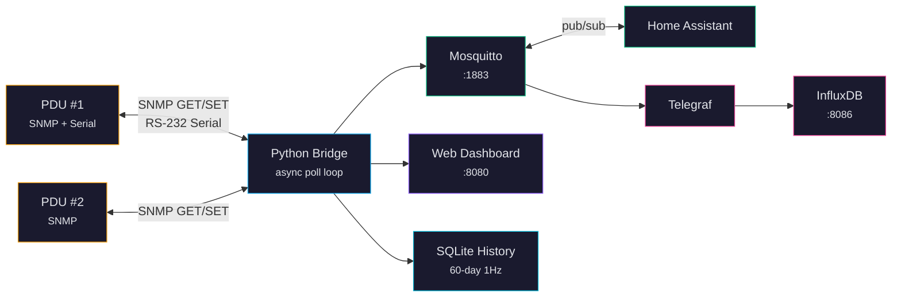

# CyberPower PDU Bridge

A self-hosted SNMP + Serial to MQTT bridge for CyberPower PDUs — including ATS dual-source models — with a real-time web dashboard, device management, historical charts, automation rules, and Home Assistant integration.


## Quick Start

```bash
git clone https://github.com/mvalancy/CyberPower-PDU.git
cd CyberPower-PDU
./bootstrap          # Install Docker + tools (once, needs sudo)
./setup              # Create .env, pull images, build containers
nano .env            # Set PDU_HOST to your PDU's IP (or BRIDGE_MOCK_MODE=true)
./start              # Start the stack — open http://localhost:8080
```

## CLI Tools

Every user-facing operation is wrapped in a script. No raw `docker` commands needed.

| Command | What it does |
|---------|-------------|
| `./bootstrap` | Install Docker, SNMP tools, Python deps, serial access (once) |
| `./setup` | Create `.env` from template, pull images, build containers |
| `./start` | Start the Docker stack and wait for healthy services |
| `./start --stop` | Stop all containers |
| `./start --restart` | Restart all containers |
| `./start --rebuild` | Rebuild from source, then restart |
| `./start --status` | Show container and systemd service status |
| `./start --logs` | Follow live container logs |
| `./start --mqtt-passwd USER` | Create/update an MQTT password for USER |
| `./start --db-size` | Show history database file size |
| `./start --db-compact` | VACUUM the database to reclaim disk space |
| `./start --check-time` | Show the bridge container's current date/time |
| `./start --install` | Install systemd service for auto-start on boot |
| `./start --uninstall` | Remove the systemd service |
| `./scan` | Discover CyberPower PDUs on the network via SNMP |
| `./wizard` | Interactive first-time setup (discover PDUs, write config) |
| `./test` | Run unit tests with branded HTML report |
| `./test --mock` | Full Docker integration test with simulated data |
| `./test --hardware` | Hardware validation suite (needs `PDU_HOST`) |
| `./test --e2e-mock` | Playwright browser E2E tests |

## First-Time Setup

1. Run `./bootstrap` to install system dependencies (Docker, SNMP tools, serial access)
2. Run `./setup` to create `.env` and build containers
3. Edit `.env` — set `PDU_HOST` to your PDU's IP, or set `BRIDGE_MOCK_MODE=true` to try without hardware
4. Run `./start` to launch the stack
5. Open **http://localhost:8080**
6. **Secure your system** — see [Security](docs/security.md) to lock down MQTT, change default PDU credentials, and enable dashboard auth

## Monitoring

| Service | Port | Description |
|---------|------|-------------|
| Bridge + Web UI | 8080 | Dashboard, REST API, automation engine |
| Mosquitto | 1883 / 9001 | MQTT broker (TCP + WebSocket) |
| InfluxDB | 8086 | Time-series database + UI (optional) |
| Telegraf | -- | MQTT-to-InfluxDB pipe (optional) |

```bash
./start --status          # Container health at a glance
curl localhost:8080/api/health   # JSON health check
```

## Architecture



## Documentation

| Guide | What's in it |
|-------|-------------|
| [Getting Started](docs/getting-started.md) | Prerequisites, setup, mock mode, features |
| [Configuration](docs/configuration.md) | All `.env` variables, `pdus.json`, automation rules |
| [API Reference](docs/api-reference.md) | REST API with request/response examples |
| [Architecture](docs/architecture.md) | System design, data flow, bridge internals |
| [MQTT Topics](docs/mqtt-topics.md) | Full topic hierarchy with payload formats |
| [SNMP OIDs](docs/snmp-oids.md) | CyberPower ePDU/ePDU2 MIB reference |
| [Multi-PDU](docs/multi-pdu.md) | Monitoring multiple PDUs from one bridge |
| [Security](docs/security.md) | Hardening SNMP, MQTT, InfluxDB, web UI |
| [Troubleshooting](docs/troubleshooting.md) | Symptom-based diagnostic guide |

## License

GPL-3.0 License -- Copyright (c) 2026 Matthew Valancy, Valpatel Software LLC

See [LICENSE](LICENSE) for the full text.
