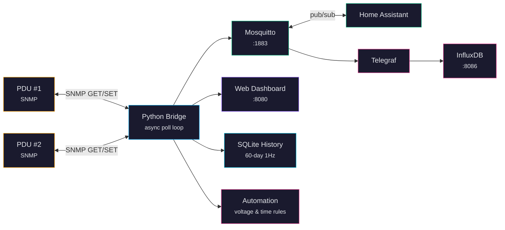

# CyberPower PDU Bridge

A multi-PDU SNMP-to-MQTT bridge for the CyberPower product family — including **Automatic Transfer Switch (ATS)** models — with a real-time web dashboard, historical charts, automation rules, and Home Assistant integration.


---

## What Is This?

A **PDU** (Power Distribution Unit) is a smart power strip for server racks. CyberPower's ATS models go further: they accept **two independent power sources** (e.g., grid/utility power on Input A and a battery inverter like EcoFlow, Bluetti, or a whole-house solar system on Input B) and automatically switch between them if the primary source fails. This gives your equipment uninterrupted power — even during outages.

These PDUs communicate using SNMP, a decades-old protocol that most modern tools do not understand natively. This project bridges that gap. It polls your CyberPower PDUs over SNMP, translates the data into MQTT (the standard for IoT), stores history in a local SQLite database, and serves a web dashboard — all from a single Docker container. No cloud services, no subscriptions, no external dependencies.

## Why Would I Want It?

- **Dual-source power monitoring** -- See both inputs in real time: grid/utility on A, battery/solar/inverter on B. Know instantly when the ATS transfers and which source is active.
- **Protect equipment during transfers** -- Automation rules can shed non-critical loads before a transfer happens, preventing backfeed or overloading a battery inverter (e.g., EcoFlow, Bluetti, whole-house Enphase).
- **See everything at a glance** -- Live dashboard showing outlet states, power draw per bank, ATS transfer switch status, and per-source voltage/frequency.
- **Control outlets remotely** -- Turn outlets on, off, or reboot them from the web UI, MQTT, or REST API.
- **Track power history** -- 60 days of 1-second-resolution charts with CSV export.
- **Automate with rules** -- "If voltage drops below 108V, turn off outlet 5." "When ATS switches to Source B, shed the lab equipment." "At 10 PM, shut down the lights."
- **Integrate with Home Assistant** -- MQTT auto-discovery creates switches and sensors automatically.
- **Monitor multiple PDUs** -- Single bridge instance handles any number of CyberPower PDUs.
- **Run without a PDU** -- Mock mode generates realistic simulated data for development and demos.

---

## Quick Start

```bash
git clone https://github.com/mvalancy/CyberPower-PDU.git
cd CyberPower-PDU
./setup        # Creates .env, pulls images, builds containers
# Edit .env with your PDU's IP address
./run          # Starts the stack, waits for healthy
```

Open **http://localhost:8080** to see the dashboard.

To try without a PDU, set `BRIDGE_MOCK_MODE=true` in `.env` before running `./run`.

---

## Architecture



The Python bridge is the central component. It is the only thing that speaks SNMP. Everything else communicates through MQTT or the built-in REST API. Telegraf and InfluxDB are optional -- the bridge stores 60 days of history in SQLite with zero external dependencies.

---

## Features

### Real-Time Monitoring
- ATS dual-source monitoring with animated transfer switch diagram
- Per-bank voltage, current, power, apparent power, and power factor
- Per-outlet state, current, power, and cumulative energy (kWh)
- 1-second poll resolution

### Outlet Control
- On/off/reboot via web dashboard, MQTT, or REST API
- Custom outlet naming with persistence across restarts
- SNMP SET for device name and location

### Historical Data
- 60 days of 1Hz samples in SQLite (WAL mode)
- Auto-downsampling for fast chart rendering (1s to 30m resolution)
- CSV export for banks and outlets
- Weekly energy reports with per-outlet breakdown

### Automation Engine
- Voltage threshold rules (brownout protection)
- ATS source monitoring (backup power shedding)
- Time-of-day schedules with midnight wrapping
- Auto-restore when conditions clear
- Configurable delay to avoid flickering

### Home Assistant Integration
- MQTT auto-discovery for switches, sensors, and binary sensors
- Per-device entities with model and firmware metadata
- Bridge online/offline status via LWT

### Multi-PDU Support
- Monitor any number of PDUs from a single bridge instance
- Per-device MQTT namespacing, automation rules, and outlet names
- Network scanner and interactive setup wizard
- REST API for PDU management

### Health Monitoring
- Docker HEALTHCHECK integration
- Per-subsystem health reporting (SNMP, MQTT, history)
- PDU reboot detection via sysUptime
- Graduated logging with automatic error suppression

---

## Configuration

The four most common settings in `.env`:

| Variable | Default | What It Does |
|----------|---------|-------------|
| `PDU_HOST` | `192.168.20.177` | Your PDU's IP address |
| `BRIDGE_MOCK_MODE` | `false` | `true` for simulated data (no real PDU needed) |
| `BRIDGE_POLL_INTERVAL` | `1.0` | Seconds between polls |
| `HISTORY_RETENTION_DAYS` | `60` | Days of history to keep |

See [Configuration](docs/configuration.md) for the full reference.

---

## Web Dashboard


The single-page web UI provides real-time monitoring, outlet control, historical charts, and automation management.

---

## Documentation

| Document | Description |
|----------|-------------|
| [Getting Started](docs/getting-started.md) | Step-by-step from clone to dashboard |
| [Configuration](docs/configuration.md) | All environment variables, pdus.json format, automation rules |
| [API Reference](docs/api-reference.md) | Complete REST API with request/response examples |
| [Architecture](docs/architecture.md) | System design, data flow diagrams, bridge internals |
| [MQTT Topics](docs/mqtt-topics.md) | Full topic hierarchy with payload formats |
| [SNMP OIDs](docs/snmp-oids.md) | CyberPower ePDU and ePDU2 MIB OID reference |
| [Multi-PDU](docs/multi-pdu.md) | Monitoring multiple PDUs from one bridge |
| [Security](docs/security.md) | Hardening SNMP, MQTT, InfluxDB, and the web UI |
| [Troubleshooting](docs/troubleshooting.md) | Symptom-based diagnostic guide |

---

## Services

| Service | Port | Description |
|---------|------|-------------|
| Bridge + Web UI | 8080 | SNMP-to-MQTT bridge + dashboard |
| Mosquitto | 1883 (MQTT), 9001 (WS) | Message broker |
| InfluxDB | 8086 | Time-series database + UI (optional) |
| Telegraf | -- | MQTT consumer to InfluxDB (optional) |

---

## Testing

```bash
./test              # Test against real PDU
./test --mock       # Full stack with simulated data
./test --snmpwalk   # OID discovery walk
pytest tests/ -v    # Unit tests (452 tests)
```

---

## License

MIT License -- Copyright (c) 2026 Matthew Valancy, Valpatel Software LLC

See [LICENSE](LICENSE) for the full text.
