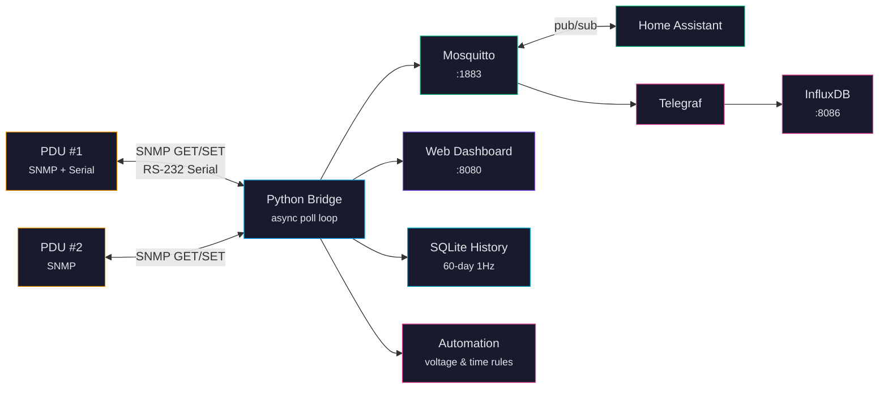

# CyberPower PDU Bridge

A self-hosted SNMP + Serial to MQTT bridge for CyberPower PDUs — including **Automatic Transfer Switch (ATS)** models — with a real-time web dashboard, full device management, historical charts, automation rules, and Home Assistant integration.


---

## What Is This?

A **PDU** (Power Distribution Unit) is a smart power strip for server racks. CyberPower's ATS models accept **two independent power sources** — for example, grid/utility power on Input A and a battery inverter (EcoFlow, Bluetti, whole-house solar) on Input B — and automatically switch between them if the primary fails.

These PDUs speak SNMP and have an RS-232 serial console, both decades-old protocols that most modern tools don't understand. This project bridges that gap: it polls your PDUs, translates everything into MQTT, stores history in SQLite, and serves a web dashboard. One Docker container, no cloud, no subscriptions.

## Why Would I Want It?

- **Dual-source power monitoring** — See both inputs in real time: grid on A, battery/solar on B. Know instantly when the ATS transfers.
- **Protect equipment during transfers** — Automation rules shed non-critical loads before a transfer, preventing backfeed or overloading a battery inverter.
- **See everything at a glance** — Live dashboard: outlet states, power draw per bank, ATS status, per-source voltage/frequency.
- **Control outlets remotely** — On/off/reboot from the web UI, MQTT, or REST API.
- **Track power history** — 60 days of 1-second charts with CSV export.
- **Automate with rules** — "If voltage drops below 108V, turn off outlet 5." "When ATS switches to Source B, shed the lab." "At 10 PM, lights off."
- **Home Assistant integration** — MQTT auto-discovery creates switches and sensors automatically.
- **Multiple PDUs** — One bridge instance handles any number of CyberPower PDUs.
- **Full device management** — Change thresholds, ATS settings, network config, passwords, and notifications from the web UI (requires serial connection or mock mode).

---

## Quick Start (5 Minutes)

### Prerequisites

- Docker and Docker Compose
- A CyberPower PDU on your network (or use mock mode to try without one)
- (Optional) A USB-to-RS232 adapter for serial management

### 1. Clone and Setup

```bash
git clone https://github.com/mvalancy/CyberPower-PDU.git
cd CyberPower-PDU
./setup        # Creates .env from template, pulls images, builds containers
```

### 2. Configure Your PDU Connection

Edit `.env` with your PDU's IP address:

```bash
PDU_HOST=192.168.1.100        # Your PDU's IP
PDU_COMMUNITY_READ=public     # SNMP read community (default on most PDUs)
PDU_COMMUNITY_WRITE=private   # SNMP write community (for outlet control)
```

> **No PDU?** Set `BRIDGE_MOCK_MODE=true` to run with simulated data.

### 3. Start

```bash
./run          # Starts the Docker stack, waits for healthy
```

Open **http://localhost:8080** to see the dashboard.

---

## Connecting to Your PDU

You can connect via **SNMP (network)**, **RS-232 serial**, or **both** with automatic failover.

### Option A: SNMP Only (Monitoring + Outlet Control)

This is the default. Set your PDU's IP in `.env`:

```bash
PDU_HOST=192.168.1.100
PDU_TRANSPORT=snmp
```

SNMP gives you full monitoring and outlet on/off/reboot, but **not** management features like changing thresholds, ATS settings, or passwords.

### Option B: Serial Only (Full Management)

Connect a USB-to-RS232 cable from your server to the PDU's serial port. The bridge auto-discovers serial adapters at `/dev/ttyUSB*`.

```bash
PDU_SERIAL_PORT=/dev/ttyUSB0
PDU_SERIAL_USERNAME=cyber       # Factory default
PDU_SERIAL_PASSWORD=cyber       # Factory default
PDU_TRANSPORT=serial
```

Serial gives you **everything**: monitoring, outlet control, plus full management (thresholds, ATS config, network settings, passwords, notifications, event logs).

**Cable requirements:** Standard DB9 RS-232 straight-through cable, 9600 baud, 8N1. Most USB-to-serial adapters (FTDI, Prolific, CH340) work. The Docker container auto-maps `/dev/serial` for hot-plug support.

### Option C: Both (Recommended for Production)

Use SNMP as the primary transport with serial as automatic failover:

```bash
PDU_HOST=192.168.1.100
PDU_SERIAL_PORT=/dev/ttyUSB0
PDU_SERIAL_USERNAME=cyber
PDU_SERIAL_PASSWORD=cyber
PDU_TRANSPORT=snmp              # SNMP is primary, serial is fallback
```

If SNMP fails (network issue, DHCP change), the bridge automatically switches to serial. When SNMP recovers, it switches back. The dashboard shows which transport is active.

---

## Securing Your System

CyberPower PDUs ship with weak defaults. **Secure these before exposing anything to your network.**

### Step 1: Change PDU Default Credentials

CyberPower PDUs ship with username `cyber` and password `cyber`. Anyone on your network who knows this can control your outlets.

**Change the password** via the web dashboard (Settings > Manage > Security) or the REST API:

```bash
curl -X POST http://localhost:8080/api/pdu/security/password \
  -H 'Content-Type: application/json' \
  -d '{"current_password": "cyber", "new_password": "YourStrongPassword"}'
```

Then update `.env` to match:

```bash
PDU_SERIAL_PASSWORD=YourStrongPassword
```

> **Requires serial connection.** Password changes go through the RS-232 console. SNMP alone cannot change the PDU password.

### Step 2: Secure MQTT (Prevent Accidental Outlet Control)

**By default, MQTT allows anonymous connections.** This means anything on your network can publish to the outlet command topics and turn outlets on or off. This is the single most important thing to lock down.

#### Enable MQTT Authentication

1. Create a password file:

```bash
docker exec -it cyberpower-pdu-mosquitto-1 \
  mosquitto_passwd -c /mosquitto/data/passwd pdu_bridge
# Enter a strong password when prompted
```

2. Update `mosquitto/mosquitto.conf`:

```
listener 1883
protocol mqtt

listener 9001
protocol websockets

# Require authentication — no anonymous access
allow_anonymous false
password_file /mosquitto/data/passwd
```

3. Add credentials to `.env`:

```bash
MQTT_USERNAME=pdu_bridge
MQTT_PASSWORD=YourMQTTPassword
```

4. Restart: `docker compose down && ./run`

Now only authenticated clients can publish outlet commands. Home Assistant and other consumers need these credentials too.

#### Why This Matters

Without MQTT auth, any device on your LAN can:
- Turn off outlets by publishing to `pdu/<id>/outlet/<n>/command`
- Interfere with automation rules
- Spoof PDU status data

With auth enabled, only clients with the password can publish or subscribe.

### Step 3: Enable Web Dashboard Authentication

The web UI is open by default. To require a login:

```bash
BRIDGE_WEB_PASSWORD=YourDashboardPassword
BRIDGE_WEB_USERNAME=admin                    # Optional, defaults to "admin"
BRIDGE_SESSION_SECRET=random-32-char-string  # Used to sign session cookies
```

When set, the dashboard shows a login screen. Sessions expire after 24 hours (configurable via `BRIDGE_SESSION_TIMEOUT`).

### Step 4: Change SNMP Community Strings

The defaults `public`/`private` are well-known. Change them on your PDU (via its web interface or serial console) and update `.env`:

```bash
PDU_COMMUNITY_READ=myReadString
PDU_COMMUNITY_WRITE=myWriteString
```

### Step 5: Network Isolation

Put your PDUs on a dedicated VLAN or subnet. The bridge needs to reach:
- Your PDU(s) on SNMP port 161/UDP
- Mosquitto on port 1883/TCP (localhost when using Docker host networking)

No other services need direct PDU access. The bridge is the single gateway.

### Security Checklist

| Item | Default | Action |
|------|---------|--------|
| PDU password | `cyber`/`cyber` | Change via serial or dashboard |
| SNMP community | `public`/`private` | Change on PDU + `.env` |
| MQTT auth | Anonymous allowed | Enable password file (see above) |
| Web dashboard | No login | Set `BRIDGE_WEB_PASSWORD` |
| InfluxDB | `changeme123` | Change in `.env` before first run |
| Network | Flat LAN | Isolate PDUs on dedicated VLAN |

---

## Architecture



The Python bridge is the only component that speaks SNMP or serial. Everything else communicates through MQTT or the built-in REST API. Telegraf and InfluxDB are optional — the bridge stores 60 days of history in SQLite with zero external dependencies.

---

## Features

### Real-Time Monitoring
- ATS dual-source monitoring with animated transfer switch diagram
- Per-bank voltage, current, power, apparent power, and power factor
- Per-outlet state, current, power, and cumulative energy (kWh)
- Environmental monitoring (temperature, humidity, contact closures)
- 1-second poll resolution

### Dual Transport: SNMP + Serial
- SNMP (network) for monitoring and basic outlet control
- RS-232 serial console for full PDU management
- Automatic failover between transports with health tracking
- Serial port auto-discovery for USB-to-serial adapters

### Outlet Control
- On/off/reboot via web dashboard, MQTT, or REST API
- Delayed on/off commands with cancel support
- Custom outlet naming with persistence across restarts

### Full PDU Management (via Serial)
- Load threshold configuration (overload, near-overload, low-load per bank)
- ATS configuration (preferred source, sensitivity, voltage limits, coldstart delay)
- Network configuration (IP, subnet, gateway, DHCP)
- Security: default credential detection, password change
- Notification configuration (SNMP traps, SMTP, email recipients, syslog)
- EnergyWise power saving configuration
- User account management
- Event log viewer

### Historical Data
- 60 days of 1Hz samples in SQLite (WAL mode)
- Auto-downsampling for fast chart rendering (1s to 30m resolution)
- CSV export for banks and outlets
- Weekly energy reports with per-outlet breakdown

### Automation Engine
- Voltage threshold rules (brownout protection)
- ATS source monitoring (backup power shedding)
- Time-of-day schedules with midnight wrapping
- Days-of-week filtering and one-shot rules
- Multi-outlet targeting (comma-separated or range syntax)
- Auto-restore when conditions clear
- Enable/disable toggle per rule

### Home Assistant Integration
- MQTT auto-discovery for switches, sensors, and binary sensors
- Per-device entities with model and firmware metadata
- Bridge online/offline status via LWT

### Multi-PDU Support
- Monitor any number of PDUs from a single bridge instance
- Per-device MQTT namespacing, automation rules, and outlet names
- Network scanner and interactive setup wizard (`./wizard`)
- REST API for runtime PDU management (add/remove/test)

### Health & Resilience
- Docker HEALTHCHECK integration
- DHCP resilience: if your PDU changes IP, the bridge auto-recovers via subnet scan or serial fallback
- Graduated state machine (HEALTHY > DEGRADED > RECOVERING > LOST)
- MQTT publish queue with reconnect drain
- SQLite auto-recovery after write errors

---

## Configuration Reference

### Essential Settings (`.env`)

| Variable | Default | Description |
|----------|---------|-------------|
| `PDU_HOST` | `192.168.20.177` | PDU IP address |
| `PDU_TRANSPORT` | `snmp` | Primary transport: `snmp` or `serial` |
| `BRIDGE_MOCK_MODE` | `false` | `true` for simulated data (no real PDU) |
| `BRIDGE_POLL_INTERVAL` | `1.0` | Seconds between polls |

### SNMP Settings

| Variable | Default | Description |
|----------|---------|-------------|
| `PDU_SNMP_PORT` | `161` | SNMP port |
| `PDU_COMMUNITY_READ` | `public` | SNMP read community string |
| `PDU_COMMUNITY_WRITE` | `private` | SNMP write community string |
| `BRIDGE_SNMP_TIMEOUT` | `2.0` | SNMP request timeout (seconds) |
| `BRIDGE_SNMP_RETRIES` | `1` | SNMP retry count |

### Serial Settings

| Variable | Default | Description |
|----------|---------|-------------|
| `PDU_SERIAL_PORT` | *(empty)* | Serial device path (e.g., `/dev/ttyUSB0`) |
| `PDU_SERIAL_BAUD` | `9600` | Baud rate |
| `PDU_SERIAL_USERNAME` | `cyber` | PDU console username |
| `PDU_SERIAL_PASSWORD` | `cyber` | PDU console password |

### MQTT Settings

| Variable | Default | Description |
|----------|---------|-------------|
| `MQTT_BROKER` | `mosquitto` | Broker hostname |
| `MQTT_PORT` | `1883` | Broker port |
| `MQTT_USERNAME` | *(empty)* | MQTT username (enable auth first) |
| `MQTT_PASSWORD` | *(empty)* | MQTT password |

### Web Dashboard

| Variable | Default | Description |
|----------|---------|-------------|
| `BRIDGE_WEB_PORT` | `8080` | Dashboard port |
| `BRIDGE_WEB_USERNAME` | `admin` | Dashboard login username |
| `BRIDGE_WEB_PASSWORD` | *(empty)* | Set to enable login requirement |
| `BRIDGE_SESSION_SECRET` | *(empty)* | Cookie signing secret |
| `BRIDGE_SESSION_TIMEOUT` | `86400` | Session lifetime in seconds (default 24h) |

### History & Reports

| Variable | Default | Description |
|----------|---------|-------------|
| `HISTORY_RETENTION_DAYS` | `60` | Days of history to retain |
| `HOUSE_MONTHLY_KWH` | `0` | Household monthly kWh for energy reports |

See [docs/configuration.md](docs/configuration.md) for the complete reference including multi-PDU `pdus.json` format.

---

## Services

| Service | Port | Description |
|---------|------|-------------|
| Bridge + Web UI | 8080 | SNMP/Serial bridge + dashboard |
| Mosquitto | 1883 (MQTT), 9001 (WS) | Message broker |
| InfluxDB | 8086 | Time-series database + UI (optional) |
| Telegraf | -- | MQTT consumer to InfluxDB (optional) |

---

## Documentation

| Document | Description |
|----------|-------------|
| [Getting Started](docs/getting-started.md) | Step-by-step from clone to dashboard |
| [Configuration](docs/configuration.md) | All environment variables, pdus.json, automation rules |
| [API Reference](docs/api-reference.md) | Complete REST API with request/response examples |
| [Architecture](docs/architecture.md) | System design, data flow, bridge internals |
| [MQTT Topics](docs/mqtt-topics.md) | Full topic hierarchy with payload formats |
| [SNMP OIDs](docs/snmp-oids.md) | CyberPower ePDU and ePDU2 MIB OID reference |
| [Multi-PDU](docs/multi-pdu.md) | Monitoring multiple PDUs from one bridge |
| [Security](docs/security.md) | Hardening SNMP, MQTT, InfluxDB, and the web UI |
| [Troubleshooting](docs/troubleshooting.md) | Symptom-based diagnostic guide |

---

## Testing

```bash
./test              # Unit tests with branded HTML report
./test --e2e-mock   # Playwright browser E2E tests (auto-starts mock bridge)
./test --hardware   # Hardware validation suite (needs PDU_HOST or PDU_SERIAL_PORT)
./test --mock       # Full Docker stack integration test with simulated data
./test --real       # Integration test against real PDU via SNMP
./test --snmpwalk   # OID discovery walk (saves to file)
```

---

## License

GPL-3.0 License -- Copyright (c) 2026 Matthew Valancy, Valpatel Software LLC

See [LICENSE](LICENSE) for the full text.
