# CyberPower PDU44001 Monitoring & Control

SNMP-to-MQTT bridge for the CyberPower PDU44001 switched PDU with a built-in web dashboard, SQLite history, automation rules, and optional InfluxDB storage via Telegraf.


## Architecture

```mermaid
graph LR
    PDU["🔌 PDU44001<br/><small>192.168.20.177</small>"]
    Bridge["🐍 Python Bridge<br/><small>SNMP ↔ MQTT</small>"]
    MQTT["📡 Mosquitto<br/><small>:1883 / :9001</small>"]
    WebUI["🖥️ Web Dashboard<br/><small>:8080</small>"]
    SQLite["💾 SQLite<br/><small>history.db</small>"]
    Telegraf["📊 Telegraf"]
    InfluxDB["📈 InfluxDB<br/><small>:8086</small>"]
    Clients["🏠 MQTT Clients<br/><small>HA · Node-RED · CLI</small>"]

    PDU <-->|"SNMP GET/SET"| Bridge
    Bridge -->|"MQTT pub"| MQTT
    MQTT -->|"MQTT sub"| Bridge
    Bridge --> SQLite
    Bridge --> WebUI
    MQTT -->|"subscribe"| Telegraf
    Telegraf --> InfluxDB
    MQTT <-->|"sub/pub"| Clients

    style PDU fill:#1a1a2e,stroke:#00dc82,color:#e2e4e9
    style Bridge fill:#1a1a2e,stroke:#0ea5e9,color:#e2e4e9
    style MQTT fill:#1a1a2e,stroke:#f59e0b,color:#e2e4e9
    style WebUI fill:#1a1a2e,stroke:#8b5cf6,color:#e2e4e9
    style SQLite fill:#1a1a2e,stroke:#06b6d4,color:#e2e4e9
    style Telegraf fill:#1a1a2e,stroke:#ec4899,color:#e2e4e9
    style InfluxDB fill:#1a1a2e,stroke:#ec4899,color:#e2e4e9
    style Clients fill:#1a1a2e,stroke:#10b981,color:#e2e4e9
```



The Python bridge is the only component that speaks SNMP. Everything else communicates via MQTT. The bridge also serves a real-time web dashboard and stores history in a self-contained SQLite database.

## Web Dashboard

The single-page web UI provides real-time monitoring, outlet control, historical charts, and automation management — all without external dependencies.

### ATS & Power Sources

Live dual-source monitoring with animated transfer switch diagram, per-bank metering, and source health indicators.


### Outlet Control

Individual outlet tiles with on/off control, power readings, and inline renaming. Custom names persist across restarts.


### Historical Charts

Canvas-rendered power, voltage, and current graphs with configurable time ranges (1h to 30d) and CSV export. Data auto-downsamples for longer ranges.


### Automation Rules

Create rules that trigger outlet actions based on voltage thresholds or time-of-day schedules. Supports midnight-wrapping time ranges (e.g., `22:00-06:00`).


## Quick Start

```bash
./setup    # Install dependencies, build containers
./run      # Start the stack
```

## Configuration

Copy `.env.example` to `.env` and adjust:

| Variable | Default | Description |
|----------|---------|-------------|
| `PDU_HOST` | `192.168.20.177` | PDU IP address |
| `PDU_COMMUNITY_READ` | `public` | SNMP read community |
| `PDU_COMMUNITY_WRITE` | `private` | SNMP write community |
| `PDU_DEVICE_ID` | `pdu44001` | Device identifier in MQTT topics |
| `BRIDGE_POLL_INTERVAL` | `1.0` | Seconds between polls |
| `BRIDGE_MOCK_MODE` | `false` | Use simulated PDU data |
| `HISTORY_RETENTION_DAYS` | `60` | Days of 1Hz history to retain |
| `HOUSE_MONTHLY_KWH` | `0` | House monthly kWh (for energy report comparison) |

## MQTT Topics


See [docs/mqtt-topics.md](docs/mqtt-topics.md) for the complete topic reference.

## Testing

```bash
./test              # Test against real PDU
./test --mock       # Full stack with simulated data
./test --snmpwalk   # OID discovery walk
```

Unit tests:
```bash
pip install pytest pytest-asyncio
pytest tests/ -v
```

## Monitoring

```bash
# Watch all MQTT messages
mosquitto_sub -t 'pdu/#' -v

# Toggle an outlet
mosquitto_pub -t 'pdu/pdu44001/outlet/1/command' -m 'off'

# Bridge logs
docker compose logs -f bridge

# Web dashboard
open http://localhost:8080
```

## Services

| Service | Port | Description |
|---------|------|-------------|
| Bridge + Web UI | 8080 | SNMP-to-MQTT bridge + dashboard |
| Mosquitto | 1883 (MQTT), 9001 (WS) | Message broker |
| InfluxDB | 8086 | Time-series database + UI |
| Telegraf | — | MQTT consumer to InfluxDB |

## Docs

- [Architecture](docs/architecture.md) — system design, data flow, bridge internals
- [MQTT Topics](docs/mqtt-topics.md) — complete topic reference with payload formats
- [SNMP OIDs](docs/snmp-oids.md) — CyberPower ePDU MIB OID table
