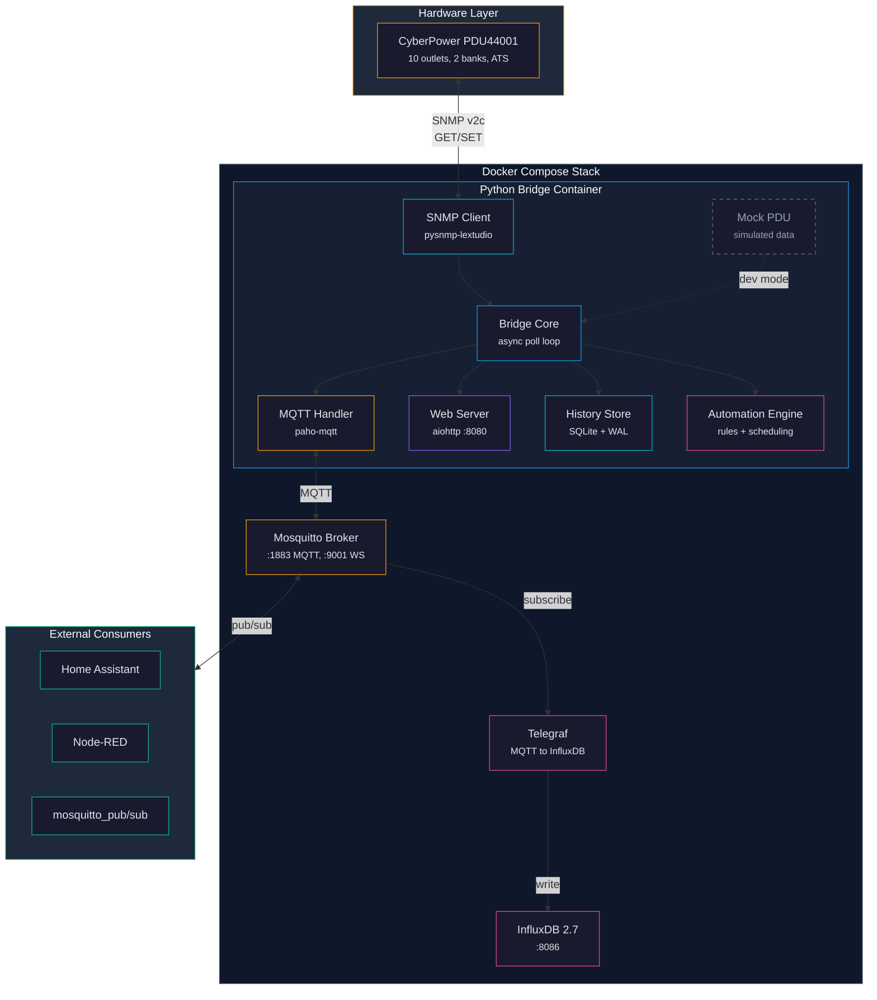
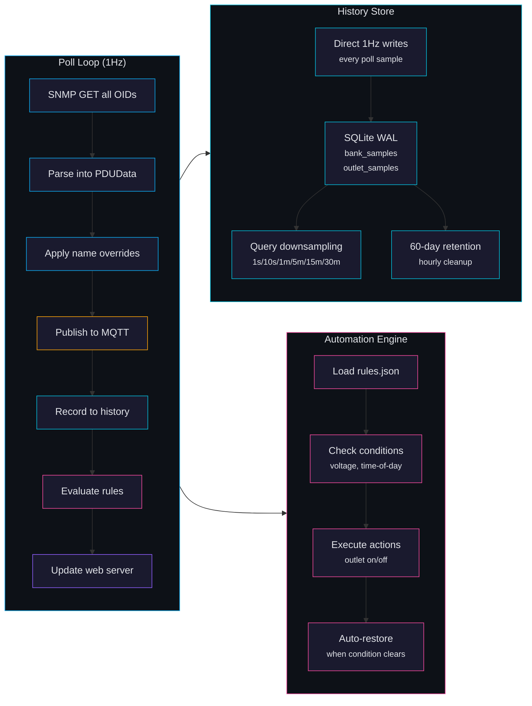
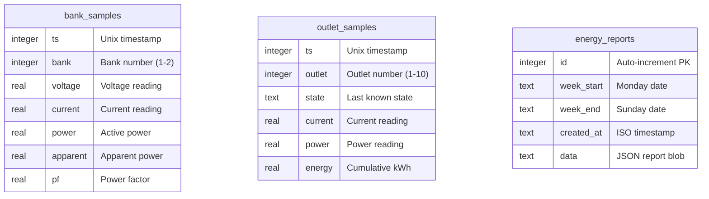

# Architecture

> **Docs:** [Getting Started](getting-started.md) | [Configuration](configuration.md) | [API Reference](api-reference.md) | [Architecture](architecture.md) | [MQTT Topics](mqtt-topics.md) | [SNMP OIDs](snmp-oids.md) | [Multi-PDU](multi-pdu.md) | [Security](security.md) | [Troubleshooting](troubleshooting.md)

This page explains how the CyberPower PDU44001 monitoring system is designed, what each piece does, and how data flows from the physical hardware to your screen.

---

## Background: Key Concepts

Before diving into the architecture, here is a quick primer on the technologies this system uses. If you are already familiar with SNMP, MQTT, ATS, and SQLite, feel free to skip to [System Architecture](#system-architecture).

### What is a PDU?

A **PDU** (Power Distribution Unit) is essentially a smart power strip for server racks. Unlike a regular power strip, a PDU can:

- **Monitor** electrical metrics like voltage, current, and power consumption per outlet or per bank of outlets.
- **Control** individual outlets remotely -- turning devices on, off, or rebooting them without physically touching the hardware.
- **Report** its status over the network using management protocols.

The **CyberPower PDU44001** is a "Switched" model with 10 outlets split across 2 banks, and it includes an ATS (see below). It exposes all of its data over SNMP.

### What is ATS?

**ATS** stands for **Automatic Transfer Switch**. It is a mechanism that connects two independent power sources to the PDU. If the primary power source fails (e.g., a utility outage on one circuit), the ATS automatically switches to the secondary source with minimal interruption. This provides redundancy for critical equipment.

In this system's web dashboard, the ATS panel shows both power sources in real time, including which source is currently active and the health of each.

### What is SNMP?

**SNMP** (Simple Network Management Protocol) is a standard protocol for monitoring and managing network devices. Think of it as a universal language that hardware devices use to report their status and accept commands. Nearly all enterprise PDUs, switches, routers, and UPS units speak SNMP.

- **SNMP GET**: Read a value from the device (e.g., "What is the voltage on bank 1?").
- **SNMP SET**: Write a value to the device (e.g., "Turn outlet 3 off").
- **OID** (Object Identifier): A numeric address for each piece of data the device exposes, like a street address for a specific sensor reading. See [SNMP OIDs](snmp-oids.md) for the full list.
- **Community string**: A password-like value (e.g., `public` for read, `private` for write) used by SNMP v2c for access control.

**Why SNMP?** The PDU44001 only speaks SNMP natively -- it has no REST API, no MQTT support, and no web API. SNMP is the only way to talk to this hardware. This entire project exists to bridge that SNMP data into more modern, developer-friendly protocols.

### What is MQTT?

**MQTT** (Message Queuing Telemetry Transport) is a lightweight publish/subscribe messaging protocol designed for IoT and real-time data. Instead of polling a device for updates, MQTT lets you **subscribe** to a topic and get notified instantly when new data arrives.

Key concepts:
- **Broker**: A central server (Mosquitto, in this project) that routes messages between publishers and subscribers.
- **Topic**: A hierarchical address for a message, like `pdu/pdu44001/outlet/1/state`. Topics use `/` as separators, similar to file paths.
- **Publish**: Send a message to a topic. Any subscriber watching that topic receives it.
- **Subscribe**: Register interest in a topic (or a pattern like `pdu/#` for all PDU topics).
- **Retained message**: A message that the broker stores and delivers to new subscribers immediately upon connection, so they do not have to wait for the next update.

**Why MQTT?** MQTT is the lingua franca of home automation and IoT. Home Assistant, Node-RED, Telegraf, and dozens of other tools can consume MQTT natively. By translating the PDU's SNMP data into MQTT topics, this project makes the PDU accessible to the entire IoT ecosystem. See [MQTT Topics](mqtt-topics.md) for the full topic reference.

### What is SQLite?

**SQLite** is a lightweight, file-based database that requires no separate server process. It stores data in a single file on disk, making it ideal for embedded applications.

**Why SQLite?** This project needs historical data (charts, reports, trends) but should not require users to set up InfluxDB or any external database just to view power history. SQLite provides self-contained history storage with zero configuration. The database uses **WAL mode** (Write-Ahead Logging), which allows the web dashboard to read historical data while the bridge is simultaneously writing new samples, without any locking conflicts.

---

## System Architecture

The diagram below shows every component in the system and how they connect. The Python Bridge is the central piece -- it is the only component that talks to the PDU hardware. Everything else communicates through MQTT or the bridge's built-in web server.

**How to read this diagram:**

- **Hardware Layer** (top): The physical PDU sitting in your rack. It only speaks SNMP.
- **Docker Compose Stack** (middle): Everything runs in Docker containers. The Python Bridge container does the heavy lifting. Mosquitto, Telegraf, and InfluxDB are optional supporting services.
- **External Consumers** (bottom): Any MQTT-capable tool can subscribe to the broker and receive live PDU data.
- **Solid arrows** show data flow in production. The **dashed arrow** from Mock PDU is only active during development/testing.

---

## Data Flow

The sequence diagram below shows what happens every second during normal operation, and what happens when someone sends a command to an outlet.

**What is happening here, step by step:**

1. **Every second**, the bridge polls the PDU using SNMP GET requests to read all sensor values (voltage, current, power, outlet states, etc.).
2. The raw values go through two correction steps:
   - **Metering floor correction** -- the PDU reports phantom readings (like 1W or 0.2A) for idle outlets. These are zeroed out.
   - **Outlet name overrides** -- custom names you assign through the web dashboard replace the default PDU names.
3. The corrected data is then sent to four destinations simultaneously:
   - **MQTT** -- published as individual topics so any subscriber receives live updates.
   - **SQLite** -- written to the local database at full 1Hz resolution for historical charts.
   - **Automation engine** -- checked against your rules (e.g., "if voltage drops below 110V, turn off outlet 5").
   - **Web dashboard** -- pushed to any connected browser via the web server.
4. **Commands** (turning an outlet on/off/reboot) flow in the opposite direction: from an MQTT client through the broker to the bridge, which executes the corresponding SNMP SET on the PDU.
5. **Database maintenance** runs hourly: generating weekly energy reports and purging data older than the retention period (60 days by default).

---

## Bridge Internals

This diagram breaks down the three main subsystems inside the Python Bridge: the poll loop, the history store, and the automation engine.

**Poll Loop** -- Runs once per second. Each cycle reads every OID from the PDU, processes the data, and fans it out to all consumers. The entire cycle completes within a single second so the next poll can begin on schedule.

**History Store** -- Every poll sample is written directly to SQLite at 1Hz (one row per second). The database uses WAL mode so reads (from the web dashboard) and writes (from the poll loop) do not block each other. Commits are batched every 10 writes to reduce disk I/O. An hourly cleanup task deletes data older than 60 days.

**Automation Engine** -- Loads rules from `rules.json` and evaluates them on every poll cycle. Rules can trigger outlet actions based on voltage thresholds (e.g., "turn off non-essential outlets if voltage drops below 108V") or time-of-day schedules. When a triggering condition clears, the engine auto-restores the outlet to its previous state.

---

## Components

### Python Bridge (`bridge/`)

The bridge is the heart of the system. It is a single Python process running an async event loop that:

- Polls the PDU via SNMP GET at 1Hz (once per second)
- Publishes all readings to MQTT with retained messages
- Subscribes to command topics and executes SNMP SET for outlet control
- Stores every sample in SQLite at full 1Hz resolution (WAL mode, 60-day retention)
- Serves a real-time web dashboard via `aiohttp` on port 8080
- Runs an automation engine with voltage and time-of-day rules
- Supports mock mode for development and testing (no real PDU required)

Libraries used: `pysnmp-lextudio` (SNMP), `paho-mqtt` (MQTT), `aiohttp` (web server), `sqlite3` (history).

### Mosquitto (MQTT Broker)

[Eclipse Mosquitto](https://mosquitto.org/) is the MQTT message broker. It routes messages between the bridge and any number of subscribers.

- MQTT on port **1883**, WebSocket on port **9001**
- Configured with anonymous access (no username/password required)
- Retained messages ensure new subscribers get the latest PDU state immediately on connect

### Telegraf (optional)

[Telegraf](https://www.influxdata.com/time-series-platform/telegraf/) is a data collection agent. In this stack, it subscribes to MQTT and forwards PDU data to InfluxDB for long-term storage and advanced querying.

- Uses the `inputs.mqtt_consumer` plugin (not the SNMP plugin -- the bridge handles all SNMP)
- Subscribes to `pdu/#` topics
- Parses the topic structure into InfluxDB tags (device, type, index, metric)
- Writes to InfluxDB v2

### InfluxDB (optional)

[InfluxDB 2.7](https://docs.influxdata.com/influxdb/v2/) is a time-series database optimized for metrics. It is optional because the bridge already stores 60 days of history in SQLite. InfluxDB is useful if you want longer retention, advanced queries (Flux language), or to integrate with Grafana dashboards.

- Auto-provisioned org, bucket, and token via environment variables
- Web UI available at port 8086

---

## History Storage

The bridge stores every poll sample (1Hz) directly to a local SQLite database using WAL mode for concurrent reads. This provides self-contained historical data without requiring InfluxDB or any external database.

The database has three tables, shown in the entity-relationship diagram below:

- **bank_samples** -- One row per bank per second. Stores voltage, current, active power, apparent power, and power factor for each of the two banks.
- **outlet_samples** -- One row per outlet per second. Stores the outlet state (on/off), current, power, and cumulative energy (kWh).
- **energy_reports** -- Weekly summary reports generated automatically. Each report contains a JSON blob with aggregated energy data for the week.

### Storage and Downsampling

Samples are stored at full **1Hz resolution** (one sample per second for each bank and outlet). The default retention period is **60 days**, after which old data is automatically cleaned up by an hourly maintenance task.

When you query historical data (e.g., from the web dashboard's charts), the system automatically **downsamples** the data to keep responses fast and chart rendering smooth. Shorter time ranges give you higher resolution; longer ranges aggregate more aggressively:

| Query Range | Sample Interval | Max Points | What You See |
|-------------|----------------|------------|--------------|
| Up to 1 hour | 1 second (raw) | 3,600 | Full-resolution data, every sample |
| Up to 6 hours | 10 seconds | 2,160 | Every 10th sample |
| Up to 24 hours | 1 minute | 1,440 | 1-minute averages |
| Up to 7 days | 5 minutes | 2,016 | 5-minute averages |
| Up to 30 days | 15 minutes | 2,880 | 15-minute averages |
| 60 days | 30 minutes | 2,880 | 30-minute averages |

This means you always get a manageable number of data points (under 3,600) regardless of the time range, while still preserving full 1-second granularity for recent data.

---

## Mock Mode

Setting `BRIDGE_MOCK_MODE=true` replaces the SNMP client with a simulated PDU that generates realistic data (voltage drift, per-bank metering, random outlet state changes). This is used for:

- **Development** -- work on the dashboard or automation rules without a physical PDU.
- **CI testing** -- run automated tests in environments that cannot reach real hardware.
- **Demos** -- show the system to others without needing the actual rack hardware.

---

> **Next:** Learn about the MQTT topic structure in [MQTT Topics](mqtt-topics.md), or explore the raw SNMP data in [SNMP OIDs](snmp-oids.md).
