# Architecture

## Overview

The system bridges SNMP from a CyberPower PDU44001 to MQTT, making all PDU data available to any MQTT-connected system (Home Assistant, Node-RED, Telegraf, etc.). A built-in web dashboard and SQLite history store provide self-contained monitoring without external dependencies.

## System Architecture

## Data Flow

## Bridge Internals

```mermaid
graph LR
    subgraph Poll ["Poll Loop (1Hz)"]
        direction TB
        P1["SNMP GET all OIDs"]
        P2["Parse into PDUData"]
        P3["Apply name overrides"]
        P4["Publish to MQTT"]
        P5["Record to history"]
        P6["Evaluate rules"]
        P7["Update web server"]
        P1 --> P2 --> P3 --> P4 --> P5 --> P6 --> P7
    end

    subgraph History ["History Store"]
        direction TB
        H1["In-memory buffer<br/><small>per bank/outlet</small>"]
        H2["Minute rollover<br/><small>average + flush</small>"]
        H3["SQLite tables<br/><small>bank_samples<br/>outlet_samples</small>"]
        H4["Auto-downsampling<br/><small>1m/5m/15m/1h</small>"]
        H1 --> H2 --> H3
        H3 --> H4
    end

    subgraph Rules ["Automation Engine"]
        direction TB
        R1["Load rules.json"]
        R2["Check conditions<br/><small>voltage · time-of-day</small>"]
        R3["Execute actions<br/><small>outlet on/off</small>"]
        R4["Auto-restore<br/><small>when condition clears</small>"]
        R1 --> R2 --> R3 --> R4
    end

    Poll --> History
    Poll --> Rules

    style Poll fill:#0d1117,stroke:#0ea5e9,color:#e2e4e9
    style History fill:#0d1117,stroke:#06b6d4,color:#e2e4e9
    style Rules fill:#0d1117,stroke:#ec4899,color:#e2e4e9
    style P1 fill:#1a1a2e,stroke:#0ea5e9,color:#e2e4e9
    style P2 fill:#1a1a2e,stroke:#0ea5e9,color:#e2e4e9
    style P3 fill:#1a1a2e,stroke:#0ea5e9,color:#e2e4e9
    style P4 fill:#1a1a2e,stroke:#f59e0b,color:#e2e4e9
    style P5 fill:#1a1a2e,stroke:#06b6d4,color:#e2e4e9
    style P6 fill:#1a1a2e,stroke:#ec4899,color:#e2e4e9
    style P7 fill:#1a1a2e,stroke:#8b5cf6,color:#e2e4e9
    style H1 fill:#1a1a2e,stroke:#06b6d4,color:#e2e4e9
    style H2 fill:#1a1a2e,stroke:#06b6d4,color:#e2e4e9
    style H3 fill:#1a1a2e,stroke:#06b6d4,color:#e2e4e9
    style H4 fill:#1a1a2e,stroke:#06b6d4,color:#e2e4e9
    style R1 fill:#1a1a2e,stroke:#ec4899,color:#e2e4e9
    style R2 fill:#1a1a2e,stroke:#ec4899,color:#e2e4e9
    style R3 fill:#1a1a2e,stroke:#ec4899,color:#e2e4e9
    style R4 fill:#1a1a2e,stroke:#ec4899,color:#e2e4e9
```

## Components

### Python Bridge (`bridge/`)
- Polls PDU via SNMP GET at 1Hz
- Publishes all readings to MQTT with retained messages
- Subscribes to command topics, executes SNMP SET
- Supports mock mode for development/testing
- Single async event loop using `pysnmp-lextudio` and `paho-mqtt`
- Built-in web dashboard via `aiohttp` on port 8080
- SQLite history with 1-minute aggregation (WAL mode)
- Automation engine with voltage and time-of-day rules

### Mosquitto
- Eclipse Mosquitto 2 with anonymous access
- MQTT on port 1883, WebSocket on 9001
- Retained messages for latest state

### Telegraf
- Uses `inputs.mqtt_consumer` (not SNMP plugin)
- Subscribes to `pdu/#` topics
- Parses topic structure into tags (device, type, index, metric)
- Writes to InfluxDB v2

### InfluxDB
- InfluxDB 2.7 for time-series storage
- Auto-provisioned org/bucket/token via env vars
- Web UI at port 8086

## History Storage

The bridge stores minute-averaged samples in a local SQLite database (WAL mode for concurrent reads). This provides self-contained history without requiring InfluxDB.

### Downsampling Strategy

| Query Range | Sample Interval | Max Points |
|-------------|----------------|------------|
| < 6 hours | 1 minute | 360 |
| < 24 hours | 5 minutes | 288 |
| < 7 days | 15 minutes | 672 |
| 30+ days | 1 hour | 720 |

## Mock Mode

Setting `BRIDGE_MOCK_MODE=true` replaces SNMP with a simulated PDU that generates realistic data (voltage drift, per-bank metering, outlet states). Used for development and CI testing.
