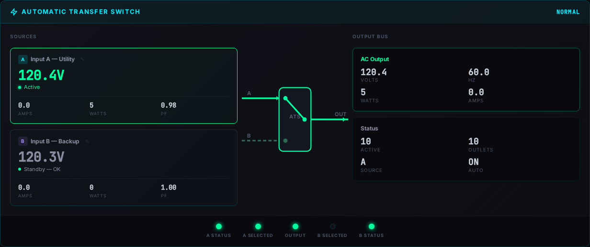
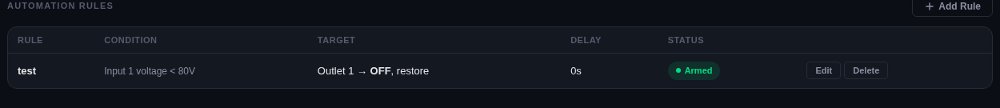
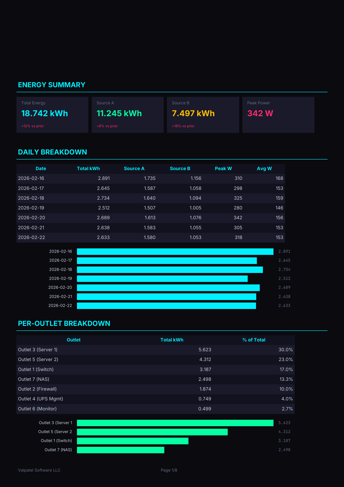

# Features

> **Docs:** [Getting Started](getting-started.md) | [Configuration](configuration.md) | [API Reference](api-reference.md) | [Architecture](architecture.md) | [MQTT Topics](mqtt-topics.md) | [SNMP OIDs](snmp-oids.md) | [Multi-PDU](multi-pdu.md) | [Security](security.md) | [Troubleshooting](troubleshooting.md) | **Features**

A visual walkthrough of every feature in the CyberPower PDU Bridge.

---

## Dashboard

- Real-time ATS dual-source monitoring with animated transfer switch diagram
- Per-bank voltage, current, power, apparent power, power factor
- Per-outlet state, current, power, cumulative energy (kWh)
- Device identity panel showing model, firmware, serial number, uptime, location
- 1-second poll resolution with live connection status indicator
- Cyberpunk-themed dark UI with Inter and JetBrains Mono fonts

## Outlet Control

- On/off/reboot any outlet via click, MQTT command, or REST API
- Delayed on and delayed off commands with cancel support
- Custom outlet naming — click the pencil icon to rename
- Per-outlet current draw and power consumption display
- Bank assignment and max load visibility

## ATS Transfer Switch

- Dual power source monitoring with real-time voltage and frequency
- Animated ATS flow diagram showing which source is active
- Source status indicators (Normal / Lost)
- Redundancy status display
- Custom source labels (e.g., "Grid" and "Solar/Battery")

## Historical Data & Charts

- 60-day retention at 1-second resolution in SQLite (WAL mode)
- Total power (W), input voltage (V), and current (A) time-series charts
- Selectable time ranges: 1H, 6H, 24H, 7D, 30D
- One-click CSV export of chart data
- Optional InfluxDB integration via Telegraf for long-term storage

## Automation Rules

- Voltage threshold conditions — brownout protection, overvoltage shedding
- ATS source conditions — shed non-critical loads when preferred source is lost
- Time-based schedules with days-of-week filtering
- Multi-outlet targeting with comma-separated or range syntax (e.g., `1,3,5` or `1-8`)
- Configurable delay, auto-restore on recovery, one-shot mode
- Enable/disable toggle without deleting rules
- Execution counter and last-fired timestamp

## Settings & Configuration

- **PDUs tab** — Add, remove, and test-connection for multiple PDUs. Network scan and serial port discovery.
- **General tab** — Polling interval, MQTT broker settings, web authentication toggle, bridge version info, system info, backup & restore.
- **Rename tab** — Device name, location, and custom source labels (stored locally per browser).

## PDU Management

- **Security** — Factory default credential detection with one-click password change
- **Network** — IP address, subnet mask, gateway, DHCP toggle
- **Load thresholds** — Device-level and per-bank near-overload / overload warning levels
- **Outlet configuration** — Per-outlet name, on/off delay, and power-on state
- **ATS configuration** — Preferred source, transfer sensitivity, voltage limits, coldstart delay
- **Notifications** — SNMP trap receivers, SMTP server, email recipients, syslog targets
- **EnergyWise** — Cisco EnergyWise integration settings
- **Event log** — Searchable PDU event log viewer with severity levels
- Transport badge shows connection type (SNMP Only / Serial / SNMP+Serial)

## Bridge Logs

- Live log viewer with auto-refresh
- Filter by level: ERROR, WARNING, INFO, DEBUG
- Full-text search across log entries
- Accessible from the Logs tab in Settings

## Authentication

- Optional web authentication — enable by setting `BRIDGE_WEB_PASSWORD` in `.env`
- Branded login overlay matching the cyberpunk dashboard theme
- Session-based JWT tokens with configurable timeout
- Bearer token support for REST API automation
- Health endpoint (`/api/health`) always accessible without auth

## Help

- 7-section in-app help modal accessible from the header
- Quick Start guide for first-time users
- Dashboard walkthrough explaining each panel
- SNMP and MQTT protocol overviews for beginners
- Troubleshooting guide with common issues
- Data retention and storage information
- Tips and keyboard shortcuts

## Energy Reports (PDF)

- Auto-generated **weekly** (every Monday) and **monthly** (1st of month) PDF energy reports
- Dark cyberpunk theme matching the web dashboard (Inter + JetBrains Mono fonts)
- **Energy summary cards** — total kWh, Source A, Source B, peak power with % change vs prior period
- **Daily breakdown** table and horizontal bar chart
- **Per-outlet breakdown** sorted by consumption with percentage of total
- **Source A vs B** daily comparison table for bill splitting
- On-demand generation from the web UI (click Weekly or Monthly)
- Reports stored on a host-accessible volume mount (`./reports/`) for easy backup
- Downloadable directly from the dashboard as PDF files
- Configurable via `BRIDGE_REPORTS_ENABLED` and `BRIDGE_REPORTS_DIR` environment variables

## Home Assistant Integration

- MQTT auto-discovery — switches, sensors, and binary sensors appear automatically
- Per-device entities with model, firmware, and serial number metadata
- Bridge online/offline status via MQTT Last Will and Testament
- Works with any MQTT-compatible home automation platform

## Multi-PDU Support

- Monitor unlimited CyberPower PDUs from a single bridge instance
- Per-device automation rules, outlet names, and history
- Network SNMP scanner discovers PDUs on the local subnet
- Serial port scanner finds USB-serial connected PDUs
- Interactive setup wizard (`./wizard`) for first-time configuration
- Add/remove PDUs at runtime through the web UI

## Dual Transport (SNMP + Serial)

- **SNMP** for fast read-only monitoring (GET/SET over the network)
- **Serial** for full device management (RS-232 console commands)
- Automatic failover with a health state machine:
  - **HEALTHY** — primary transport working normally
  - **DEGRADED** — 10+ consecutive failures, still trying primary
  - **RECOVERING** — 30+ failures, attempting fallback transport
  - **LOST** — both transports failed, subnet recovery scan triggered

## Health & Resilience

- **DHCP resilience** — auto-recovery via subnet scan when PDU IP changes
- **Transport failover** — swap primary/fallback at 10 consecutive poll failures
- **MQTT queue** — retained publishes queued on disconnect, drained on reconnect
- **SQLite recovery** — auto-reopens database connection after write errors
- Connection status dot in the header (green = healthy, red = disconnected)

## Mock Mode

- Full feature parity without any hardware — perfect for testing and demos
- Enable with `BRIDGE_MOCK_MODE=true` in `.env`
- Realistic simulated data: voltages, currents, outlet states, ATS transfers
- All UI features work identically to a real PDU connection
- Great for developing automation rules and testing integrations
