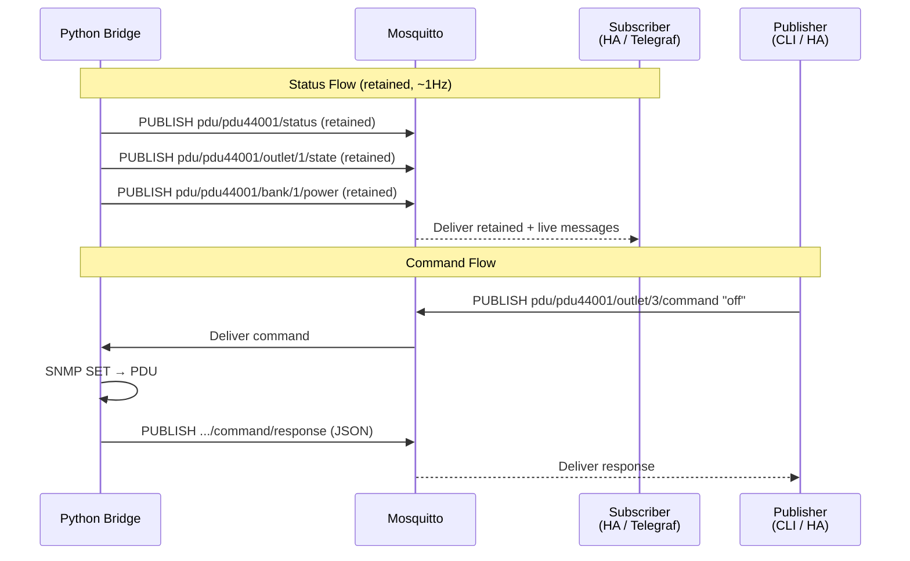

# MQTT Topic Reference

Device ID defaults to `pdu44001`. Outlet numbers are 1-indexed (1-10). Bank numbers are 1-indexed (1-2).

## Topic Hierarchy

```mermaid
graph TD
    Root["pdu/{device}"]

    Root --> Status["status<br/><small>JSON summary</small>"]
    Root --> Input["input/"]
    Root --> Outlet["outlet/{n}/"]
    Root --> Bank["bank/{n}/"]
    Root --> BridgeMeta["bridge/"]
    Root --> Auto["automation/"]

    Input --> IV["voltage"]
    Input --> IF["frequency"]

    Outlet --> OS["state"]
    Outlet --> ON["name"]
    Outlet --> OC["current"]
    Outlet --> OP["power"]
    Outlet --> OE["energy"]
    Outlet --> CMD["command"]
    CMD --> RESP["response"]

    Bank --> BC["current"]
    Bank --> BV["voltage"]
    Bank --> BP["power"]
    Bank --> BA["apparent_power"]
    Bank --> BPF["power_factor"]
    Bank --> BLS["load_state"]

    BridgeMeta --> BS["status<br/><small>LWT</small>"]

    Auto --> AStatus["status<br/><small>rules JSON</small>"]
    Auto --> AEvent["event<br/><small>trigger log</small>"]

    style Root fill:#1a1a2e,stroke:#0ea5e9,color:#e2e4e9
    style Status fill:#1a1a2e,stroke:#00dc82,color:#e2e4e9
    style Input fill:#1a1a2e,stroke:#00dc82,color:#e2e4e9
    style Outlet fill:#1a1a2e,stroke:#00dc82,color:#e2e4e9
    style Bank fill:#1a1a2e,stroke:#00dc82,color:#e2e4e9
    style BridgeMeta fill:#1a1a2e,stroke:#64748b,color:#e2e4e9
    style Auto fill:#1a1a2e,stroke:#ec4899,color:#e2e4e9
    style CMD fill:#1a1a2e,stroke:#f59e0b,color:#e2e4e9
    style RESP fill:#1a1a2e,stroke:#f59e0b,color:#e2e4e9
    style AStatus fill:#1a1a2e,stroke:#ec4899,color:#e2e4e9
    style AEvent fill:#1a1a2e,stroke:#ec4899,color:#e2e4e9
```



## Message Flow



## Status Topics (published by bridge, retained, ~1Hz)

| Topic | Payload | Description |
|-------|---------|-------------|
| `pdu/{device}/status` | JSON | Full PDU summary with timestamp |
| `pdu/{device}/input/voltage` | float | Input voltage (volts) |
| `pdu/{device}/input/frequency` | float | Input frequency (Hz) |
| `pdu/{device}/outlet/{n}/state` | `on` or `off` | Outlet relay state |
| `pdu/{device}/outlet/{n}/name` | string | Outlet name from PDU config |
| `pdu/{device}/outlet/{n}/current` | float | Current draw (amps), if available |
| `pdu/{device}/outlet/{n}/power` | float | Active power (watts), if available |
| `pdu/{device}/outlet/{n}/energy` | float | Cumulative energy (kWh), if available |
| `pdu/{device}/bank/{n}/current` | float | Bank total current (amps) |
| `pdu/{device}/bank/{n}/voltage` | float | Bank voltage (volts) |
| `pdu/{device}/bank/{n}/power` | float | Bank active power (watts) |
| `pdu/{device}/bank/{n}/apparent_power` | float | Bank apparent power (VA) |
| `pdu/{device}/bank/{n}/power_factor` | float | Bank power factor (0-1) |
| `pdu/{device}/bank/{n}/load_state` | string | `normal`, `low`, `nearOverload`, or `overload` |

## Control Topics

| Topic | Payload | Description |
|-------|---------|-------------|
| `pdu/{device}/outlet/{n}/command` | `on`, `off`, or `reboot` | Send command to outlet |
| `pdu/{device}/outlet/{n}/command/response` | JSON | Command result |

### Command Response Format

```json
{
  "success": true,
  "command": "off",
  "outlet": 1,
  "error": null,
  "ts": 1708531200.0
}
```

## Automation Topics

| Topic | Payload | Description |
|-------|---------|-------------|
| `pdu/{device}/automation/status` | JSON array | Current state of all rules |
| `pdu/{device}/automation/event` | JSON | Rule trigger/restore events |

## Bridge Meta

| Topic | Payload | Description |
|-------|---------|-------------|
| `pdu/{device}/bridge/status` | `online` or `offline` | Bridge LWT |

## Notes

- Per-outlet current/power/energy may not be available on the PDU44001 (Switched model, not Metered-by-Outlet). The bridge publishes only what the PDU reports.
- All status topics use retained messages — subscribers get the latest value immediately on connect.
- The `status` topic JSON includes a `timestamp` field (Unix epoch).
- Metering floor correction: outlets reporting 1W or 0.2A are zeroed (PDU measurement noise).
