# MQTT Topic Reference

> **Docs:** [Getting Started](getting-started.md) | [Configuration](configuration.md) | [API Reference](api-reference.md) | [Architecture](architecture.md) | [MQTT Topics](mqtt-topics.md) | [SNMP OIDs](snmp-oids.md) | [Multi-PDU](multi-pdu.md) | [Security](security.md) | [Troubleshooting](troubleshooting.md) | [Features](features.md)

Complete reference for every MQTT topic the bridge publishes and consumes. `{device}` is the device ID — auto-assigned as `pdu-01`, `pdu-02`, etc. or set manually. Outlet numbers (`{n}`) and bank numbers are 1-indexed.

---

## Quick Start

```bash
# See all topics in real time
mosquitto_sub -t 'pdu/#' -v

# Turn off outlet 3 on first PDU
mosquitto_pub -t 'pdu/pdu-01/outlet/3/command' -m 'off'
```

---

## Topic Tree

```mermaid
graph TD
    Root["pdu/{device}"]

    Root --> Status["status"]
    Root --> Device["device"]
    Root --> Input["input/"]
    Root --> Outlet["outlet/{n}/"]
    Root --> Bank["bank/{n}/"]
    Root --> ATS["ats/"]
    Root --> Source["source/{a,b}/"]
    Root --> Total["total/"]
    Root --> Coldstart["coldstart/"]
    Root --> Env["environment/"]
    Root --> BridgeMeta["bridge/"]
    Root --> Auto["automation/"]

    Input --> IV["voltage"]
    Input --> IF["frequency"]

    Outlet --> OS["state"]
    Outlet --> ON["name"]
    Outlet --> OC["current"]
    Outlet --> OP["power"]
    Outlet --> OE["energy"]
    Outlet --> CMD["command"]
    CMD --> RESP["response"]

    Bank --> BC["current"]
    Bank --> BV["voltage"]
    Bank --> BP["power"]
    Bank --> BA["apparent_power"]
    Bank --> BPF["power_factor"]
    Bank --> BEn["energy"]
    Bank --> BLS["load_state"]

    ATS --> ATSpref["preferred_source"]
    ATS --> ATScur["current_source"]
    ATS --> ATSauto["auto_transfer"]
    ATS --> ATSred["redundancy"]
    ATS --> ATSvs["voltage_sensitivity"]
    ATS --> ATStv["transfer_voltage"]
    ATS --> ATSul["voltage_upper_limit"]
    ATS --> ATSll["voltage_lower_limit"]

    Source --> SV["voltage"]
    Source --> SF["frequency"]
    Source --> SVS["voltage_status"]

    Total --> TL["load"]
    Total --> TP["power"]
    Total --> TE["energy"]

    Coldstart --> CD["delay"]
    Coldstart --> CS["state"]

    Env --> ET["temperature"]
    Env --> EH["humidity"]
    Env --> EC["contact/{n}"]

    BridgeMeta --> BS["status"]

    Auto --> AStatus["status"]
    Auto --> AEvent["event"]

    style Root fill:#1a1a2e,stroke:#0ea5e9,color:#e2e4e9
    style Status fill:#1a1a2e,stroke:#00dc82,color:#e2e4e9
    style Device fill:#1a1a2e,stroke:#00dc82,color:#e2e4e9
    style Input fill:#1a1a2e,stroke:#00dc82,color:#e2e4e9
    style Outlet fill:#1a1a2e,stroke:#00dc82,color:#e2e4e9
    style Bank fill:#1a1a2e,stroke:#00dc82,color:#e2e4e9
    style ATS fill:#1a1a2e,stroke:#00dc82,color:#e2e4e9
    style Source fill:#1a1a2e,stroke:#00dc82,color:#e2e4e9
    style Total fill:#1a1a2e,stroke:#00dc82,color:#e2e4e9
    style Coldstart fill:#1a1a2e,stroke:#00dc82,color:#e2e4e9
    style Env fill:#1a1a2e,stroke:#00dc82,color:#e2e4e9
    style BridgeMeta fill:#1a1a2e,stroke:#64748b,color:#e2e4e9
    style Auto fill:#1a1a2e,stroke:#ec4899,color:#e2e4e9
    style CMD fill:#1a1a2e,stroke:#f59e0b,color:#e2e4e9
    style RESP fill:#1a1a2e,stroke:#f59e0b,color:#e2e4e9
```



**Legend:** Green = status (bridge publishes, you subscribe). Yellow = commands (you publish, bridge subscribes). Pink = automation. Gray = bridge health.

---

## Status Summary

| Topic | Payload | Rate |
|-------|---------|------|
| `pdu/{device}/status` | JSON | ~1 Hz, retained |

Contains `device_name`, `outlet_count`, `phase_count`, `input_voltage`, `input_frequency`, `timestamp`, and an `identity` object (serial, model, firmware) when available.

---

## Device Info

| Topic | Payload | Rate |
|-------|---------|------|
| `pdu/{device}/device` | JSON | ~30 s, retained |

Low-rate publish of everything the bridge knows about the hardware:

```json
{
  "device_id": "pdu-01",
  "serial": "ABCD1234",
  "serial_numeric": "12345678",
  "model": "PDU44001",
  "name": "CyberPower PDU",
  "firmware_main": "01.01.01",
  "firmware_secondary": "01.01.01",
  "hardware_rev": 3,
  "outlet_count": 10,
  "phase_count": 1,
  "max_current": 30.0,
  "transport": "snmp",
  "state": "healthy",
  "sys_name": "PDU-Rack1",
  "sys_location": "Server Room A",
  "sys_contact": "admin@example.com",
  "timestamp": 1708531200.0
}
```

---

## Input Power

| Topic | Payload | Description |
|-------|---------|-------------|
| `pdu/{device}/input/voltage` | float | Input voltage (V) |
| `pdu/{device}/input/frequency` | float | Input frequency (Hz) |

---

## Per-Outlet

Replace `{n}` with outlet number (1-indexed).

| Topic | Payload | Description |
|-------|---------|-------------|
| `pdu/{device}/outlet/{n}/state` | `on` / `off` | Relay state |
| `pdu/{device}/outlet/{n}/name` | string | Outlet display name |
| `pdu/{device}/outlet/{n}/current` | float | Current (A) — metered models only |
| `pdu/{device}/outlet/{n}/power` | float | Power (W) — metered models only |
| `pdu/{device}/outlet/{n}/energy` | float | Energy (kWh) — metered models only |

---

## Per-Bank

Replace `{n}` with bank number (1-indexed).

| Topic | Payload | Description |
|-------|---------|-------------|
| `pdu/{device}/bank/{n}/current` | float | Bank current (A) |
| `pdu/{device}/bank/{n}/voltage` | float | Bank voltage (V) |
| `pdu/{device}/bank/{n}/power` | float | Active power (W) |
| `pdu/{device}/bank/{n}/apparent_power` | float | Apparent power (VA) |
| `pdu/{device}/bank/{n}/power_factor` | float | Power factor (0–1) |
| `pdu/{device}/bank/{n}/energy` | float | Cumulative energy (kWh) — if supported |
| `pdu/{device}/bank/{n}/last_update` | string | Timestamp of last reading — if supported |
| `pdu/{device}/bank/{n}/load_state` | string | `normal`, `low`, `nearOverload`, `overload` |

---

## ATS (Transfer Switch)

Published only on ATS-capable models. The bridge auto-detects ATS support.

### ATS Status

| Topic | Payload | Description |
|-------|---------|-------------|
| `pdu/{device}/ats/preferred_source` | `A` / `B` | Configured preferred input source |
| `pdu/{device}/ats/current_source` | `A` / `B` | Which input is currently active |
| `pdu/{device}/ats/auto_transfer` | `on` / `off` | Automatic transfer enabled |
| `pdu/{device}/ats/redundancy` | `ok` / `lost` | Dual-source redundancy status |

### ATS Configuration

| Topic | Payload | Description |
|-------|---------|-------------|
| `pdu/{device}/ats/voltage_sensitivity` | string | `Normal`, `High`, or `Low` |
| `pdu/{device}/ats/transfer_voltage` | float | Transfer trigger voltage (V) |
| `pdu/{device}/ats/voltage_upper_limit` | float | Upper voltage limit (V) |
| `pdu/{device}/ats/voltage_lower_limit` | float | Lower voltage limit (V) |

---

## Per-Source (ATS Models)

Individual readings for each power input. Replace `{s}` with `a` or `b`.

| Topic | Payload | Description |
|-------|---------|-------------|
| `pdu/{device}/source/{s}/voltage` | float | Source voltage (V) |
| `pdu/{device}/source/{s}/frequency` | float | Source frequency (Hz) |
| `pdu/{device}/source/{s}/voltage_status` | string | `normal`, `overVoltage`, `underVoltage` |

---

## Totals

Aggregate readings across all outlets/banks.

| Topic | Payload | Description |
|-------|---------|-------------|
| `pdu/{device}/total/load` | float | Total load (A) |
| `pdu/{device}/total/power` | float | Total power (W) |
| `pdu/{device}/total/energy` | float | Total energy (kWh) |

---

## Coldstart

| Topic | Payload | Description |
|-------|---------|-------------|
| `pdu/{device}/coldstart/delay` | int | Seconds to wait after power restore |
| `pdu/{device}/coldstart/state` | string | `allon` or `prevstate` |

---

## Environment

Published only when an ENVIROSENSOR probe is connected. The bridge probes for the sensor gracefully — no errors if absent.

| Topic | Payload | Description |
|-------|---------|-------------|
| `pdu/{device}/environment/temperature` | float | Temperature (degrees) |
| `pdu/{device}/environment/humidity` | float | Humidity (%) |
| `pdu/{device}/environment/contact/{n}` | `open` / `closed` | Dry contact sensors (1–4) |

---

## Commands

Publish to these topics to control outlets.

| Topic | Payload | Description |
|-------|---------|-------------|
| `pdu/{device}/outlet/{n}/command` | `on` | Turn outlet on |
| | `off` | Turn outlet off |
| | `reboot` | Power-cycle outlet |
| | `delayon` | Delayed power on (uses PDU-configured delay) |
| | `delayoff` | Delayed power off |
| | `cancel` | Cancel pending delayed command |
| `pdu/{device}/outlet/{n}/command/response` | JSON | Result published by bridge after command |

### Command Response

```json
{
  "success": true,
  "command": "off",
  "outlet": 3,
  "error": null,
  "ts": 1708531200.0
}
```

---

## Automation

| Topic | Payload | Description |
|-------|---------|-------------|
| `pdu/{device}/automation/status` | JSON array | All rule states (name, active, last trigger, etc.) |
| `pdu/{device}/automation/event` | JSON | Published when a rule fires (QoS 1, not retained) |

---

## Bridge Health

| Topic | Payload | Description |
|-------|---------|-------------|
| `pdu/{device}/bridge/status` | `online` / `offline` | Set to `online` on connect. The broker publishes `offline` via LWT if the bridge disconnects unexpectedly. |

---

## Home Assistant Auto-Discovery

The bridge publishes HA MQTT Discovery configs to `homeassistant/switch/…` and `homeassistant/sensor/…` on first poll. This creates entities automatically in Home Assistant for:

- Outlet switches (on/off/reboot)
- Bank sensors (voltage, current, power, apparent power, power factor, energy, load state)
- Input sensors (voltage, frequency)
- ATS sensors (all 8 config + status topics)
- Source A/B sensors (voltage, frequency, status)
- Coldstart sensors (delay, state)
- Total sensors (load, power, energy)
- Environment sensors (temperature, humidity)
- Bridge connectivity binary sensor

When device identity is available (serial number from SNMP), HA uses it for stable unique IDs that survive device ID renames.

---

## Notes

- **All status topics are retained.** Subscribers get the latest value immediately on connect.
- **Conditional topics.** ATS, source, environment, coldstart, per-outlet metering, and bank energy topics only appear when the hardware supports them. The bridge never publishes empty/zero placeholders.
- **Metering floor correction.** The PDU reports phantom readings (1W, 0.2A) for idle outlets. The bridge zeroes these out automatically.
- **Multi-PDU.** Each PDU gets its own `{device}` prefix. Subscribe to `pdu/#` to see all devices, or `pdu/pdu-01/#` for one.

---

> **See also:** [Architecture](architecture.md) | [SNMP OIDs](snmp-oids.md) | [Configuration](configuration.md)
