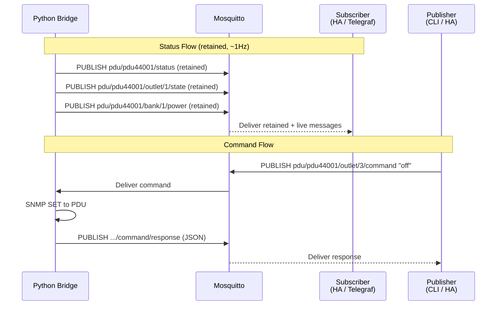

# MQTT Topic Reference

> **Docs navigation:** [Architecture](architecture.md) | [MQTT Topics](mqtt-topics.md) (you are here) | [SNMP OIDs](snmp-oids.md) | [README](../README.md)

This page is the complete reference for every MQTT topic published and consumed by the CyberPower PDU44001 bridge. If you are new to MQTT, start with the background section below. If you just need the topic tables, skip to [Topic Hierarchy](#topic-hierarchy).

---

## What is MQTT?

**MQTT** (Message Queuing Telemetry Transport) is a lightweight messaging protocol designed for the Internet of Things (IoT). It follows a **publish/subscribe** pattern, which is fundamentally different from the request/response pattern used by HTTP or SNMP.

### How publish/subscribe works

Instead of asking a device "What is your current voltage?" every second (polling), MQTT flips the model:

1. A **publisher** (the bridge) sends a message to a **topic** whenever it has new data.
2. A **subscriber** (Home Assistant, Node-RED, your script) tells the broker "I want to receive all messages on this topic."
3. A **broker** (Mosquitto) sits in the middle, receiving messages from publishers and delivering them to all matching subscribers.

This is efficient because:
- The publisher does not need to know who is listening.
- The subscriber does not need to know where the data comes from.
- Multiple subscribers can independently receive the same data without extra load on the publisher.

### Key MQTT concepts used in this project

| Concept | What It Means | How This Project Uses It |
|---------|--------------|--------------------------|
| **Topic** | A hierarchical address like `pdu/pdu44001/outlet/1/state`. The `/` separators create a tree structure, similar to file paths. | Each PDU metric has its own topic. You can subscribe to specific values or entire branches. |
| **Retained message** | A message the broker stores and delivers to any *new* subscriber immediately when they connect. Without retention, you would have to wait up to 1 second for the next update. | All status topics are retained, so any new subscriber instantly gets the current PDU state. |
| **QoS 0** | "Fire and forget" delivery. Messages are sent once with no acknowledgment. Suitable for frequently-updated sensor data where a single missed value is not critical. | All PDU sensor data uses QoS 0 since new readings arrive every second. |
| **LWT** (Last Will and Testament) | A message the broker publishes *on behalf of* a client if that client disconnects unexpectedly. | The bridge registers an LWT on `pdu/{device}/bridge/status` set to `offline`, so subscribers know immediately if the bridge goes down. |
| **Wildcard `#`** | A multi-level wildcard that matches any number of topic levels. For example, `pdu/#` matches *all* PDU topics. | Useful for debugging: `mosquitto_sub -t 'pdu/#' -v` shows every message. |

### Why MQTT for this project?

The CyberPower PDU44001 only speaks **SNMP** -- a protocol from the 1980s that most modern tools do not natively understand. MQTT, on the other hand, is the standard for IoT integration:

- **Home Assistant** has built-in MQTT support with auto-discovery.
- **Node-RED** has native MQTT nodes for building automation flows.
- **Telegraf** can consume MQTT and write to InfluxDB, Prometheus, or any other time-series database.
- **Any programming language** can subscribe to MQTT with a few lines of code.

By translating SNMP into MQTT, this project makes the PDU accessible to the entire IoT ecosystem. The bridge does all the SNMP heavy lifting so nothing else has to.

---

## Quick Start: Seeing MQTT in Action

If you want to see MQTT working right away, open a terminal and run:

```bash
# Subscribe to ALL PDU topics (shows topic names and values as they arrive)
mosquitto_sub -t 'pdu/#' -v

# In another terminal, turn off outlet 3
mosquitto_pub -t 'pdu/pdu44001/outlet/3/command' -m 'off'
```

You should see a stream of values updating every second, and after the command, a response confirming the outlet was turned off.

---

## Topic Hierarchy

```mermaid
graph TD
    Root["pdu/{device}"]

    Root --> Status["status<br/><small>JSON summary</small>"]
    Root --> Input["input/"]
    Root --> Outlet["outlet/{n}/"]
    Root --> Bank["bank/{n}/"]
    Root --> BridgeMeta["bridge/"]
    Root --> Auto["automation/"]

    Input --> IV["voltage"]
    Input --> IF["frequency"]

    Outlet --> OS["state"]
    Outlet --> ON["name"]
    Outlet --> OC["current"]
    Outlet --> OP["power"]
    Outlet --> OE["energy"]
    Outlet --> CMD["command"]
    CMD --> RESP["response"]

    Bank --> BC["current"]
    Bank --> BV["voltage"]
    Bank --> BP["power"]
    Bank --> BA["apparent_power"]
    Bank --> BPF["power_factor"]
    Bank --> BLS["load_state"]

    BridgeMeta --> BS["status<br/><small>LWT</small>"]

    Auto --> AStatus["status<br/><small>rules JSON</small>"]
    Auto --> AEvent["event<br/><small>trigger log</small>"]

    style Root fill:#1a1a2e,stroke:#0ea5e9,color:#e2e4e9
    style Status fill:#1a1a2e,stroke:#00dc82,color:#e2e4e9
    style Input fill:#1a1a2e,stroke:#00dc82,color:#e2e4e9
    style Outlet fill:#1a1a2e,stroke:#00dc82,color:#e2e4e9
    style Bank fill:#1a1a2e,stroke:#00dc82,color:#e2e4e9
    style BridgeMeta fill:#1a1a2e,stroke:#64748b,color:#e2e4e9
    style Auto fill:#1a1a2e,stroke:#ec4899,color:#e2e4e9
    style CMD fill:#1a1a2e,stroke:#f59e0b,color:#e2e4e9
    style RESP fill:#1a1a2e,stroke:#f59e0b,color:#e2e4e9
    style AStatus fill:#1a1a2e,stroke:#ec4899,color:#e2e4e9
    style AEvent fill:#1a1a2e,stroke:#ec4899,color:#e2e4e9
```

Device ID defaults to `pdu44001` (configurable via `PDU_DEVICE_ID` in `.env`). Outlet numbers are 1-indexed (1 through 10). Bank numbers are 1-indexed (1 through 2).

The diagram below shows the full topic tree. Every branch represents a group of related topics.



**How to read this diagram:**

- The **root** of all topics is `pdu/{device}`, where `{device}` is your configured device ID (default: `pdu44001`).
- **Green nodes** are status topics (published by the bridge, read by subscribers).
- **Yellow/orange nodes** are command topics (published by external tools, consumed by the bridge).
- **Pink nodes** are automation topics.
- **Gray node** (`bridge/status`) is the bridge health indicator (LWT).

---

## Message Flow

The sequence diagram below shows how messages flow for both status updates and outlet commands.



**Status flow** (top half): Every second, the bridge publishes updated readings to the broker with the `retained` flag. The broker stores these and delivers them to all current subscribers. When a new subscriber connects, it immediately receives the most recent retained value -- no waiting required.

**Command flow** (bottom half): When you (or Home Assistant, or a script) publish a command like `"off"` to an outlet's command topic, the broker delivers it to the bridge. The bridge translates this into an SNMP SET request to the PDU, waits for confirmation, and then publishes the result to the response topic.

---

## Status Topics

These topics are **published by the bridge** with retained messages, updating approximately once per second. You subscribe to these to read PDU data.

### Full Status Summary

| Topic | Payload | Description |
|-------|---------|-------------|
| `pdu/{device}/status` | JSON | Complete PDU summary with a `timestamp` field (Unix epoch). Contains all metrics in a single message -- useful if you want everything at once. |

### Input Power

These topics report the incoming power supply characteristics.

| Topic | Payload | Description |
|-------|---------|-------------|
| `pdu/{device}/input/voltage` | float | Input voltage in volts (e.g., `120.4`) |
| `pdu/{device}/input/frequency` | float | Input frequency in Hz (e.g., `60.0`) |

### Per-Outlet Metrics

Each of the 10 outlets has its own set of topics. Replace `{n}` with the outlet number (1 through 10).

| Topic | Payload | Description |
|-------|---------|-------------|
| `pdu/{device}/outlet/{n}/state` | `on` or `off` | Whether the outlet relay is currently energized |
| `pdu/{device}/outlet/{n}/name` | string | The outlet's display name (from PDU config or custom override) |
| `pdu/{device}/outlet/{n}/current` | float | Current draw in amps, if available |
| `pdu/{device}/outlet/{n}/power` | float | Active power in watts, if available |
| `pdu/{device}/outlet/{n}/energy` | float | Cumulative energy consumption in kWh, if available |

### Per-Bank Metrics

The PDU44001 has 2 banks (groups of outlets). Replace `{n}` with the bank number (1 or 2).

| Topic | Payload | Description |
|-------|---------|-------------|
| `pdu/{device}/bank/{n}/current` | float | Total current draw for the bank in amps |
| `pdu/{device}/bank/{n}/voltage` | float | Bank voltage in volts |
| `pdu/{device}/bank/{n}/power` | float | Bank active power in watts |
| `pdu/{device}/bank/{n}/apparent_power` | float | Bank apparent power in VA (volt-amps) |
| `pdu/{device}/bank/{n}/power_factor` | float | Bank power factor (0 to 1). A value of 1.0 means perfectly efficient power usage. Lower values indicate reactive loads. |
| `pdu/{device}/bank/{n}/load_state` | string | `normal`, `low`, `nearOverload`, or `overload`. Indicates whether the bank is within safe load limits. |

---

## Control Topics

These topics allow you to send commands to the PDU. You **publish** to these topics; the bridge subscribes to them and acts on your behalf.

| Topic | Payload | Description |
|-------|---------|-------------|
| `pdu/{device}/outlet/{n}/command` | `on`, `off`, or `reboot` | Send a command to outlet `{n}`. The bridge translates this into an SNMP SET. |
| `pdu/{device}/outlet/{n}/command/response` | JSON | The bridge publishes the result here after executing a command. |

### Command Response Format

After sending a command, the bridge publishes a JSON response so you can confirm the result:

```json
{
  "success": true,
  "command": "off",
  "outlet": 1,
  "error": null,
  "ts": 1708531200.0
}
```

| Field | Type | Description |
|-------|------|-------------|
| `success` | boolean | `true` if the SNMP SET was acknowledged by the PDU |
| `command` | string | The command that was executed (`on`, `off`, or `reboot`) |
| `outlet` | integer | The outlet number that was targeted |
| `error` | string or null | Error message if the command failed, otherwise `null` |
| `ts` | float | Unix timestamp when the command was processed |

---

## Automation Topics

The automation engine publishes to these topics when rules are evaluated or triggered. These are useful for monitoring what the automation system is doing.

| Topic | Payload | Description |
|-------|---------|-------------|
| `pdu/{device}/automation/status` | JSON array | Current state of all defined rules (active, idle, triggered, etc.) |
| `pdu/{device}/automation/event` | JSON | Published when a rule triggers or restores. Contains the rule name, action taken, and reason. |

---

## Bridge Meta

| Topic | Payload | Description |
|-------|---------|-------------|
| `pdu/{device}/bridge/status` | `online` or `offline` | Bridge health indicator. Set to `online` when the bridge connects, and automatically set to `offline` by the broker (via LWT) if the bridge disconnects unexpectedly. |

---

## Important Notes

- **Per-outlet current, power, and energy** may not be available on the PDU44001 (it is a "Switched" model, not "Metered-by-Outlet"). The bridge publishes only what the PDU reports. If your model does not support per-outlet metering, these topics will not appear.
- **All status topics use retained messages.** This means subscribers get the latest value immediately on connect, without waiting for the next poll cycle.
- **Metering floor correction**: The PDU reports phantom readings (1W or 0.2A) for outlets that are idle or have very low loads. The bridge automatically zeroes these out so you see clean data.
- **The `status` topic JSON** includes a `timestamp` field (Unix epoch) so you can tell when the data was last updated.

---

> **See also:** [Architecture](architecture.md) for the full system design | [SNMP OIDs](snmp-oids.md) for the raw hardware data the bridge reads
