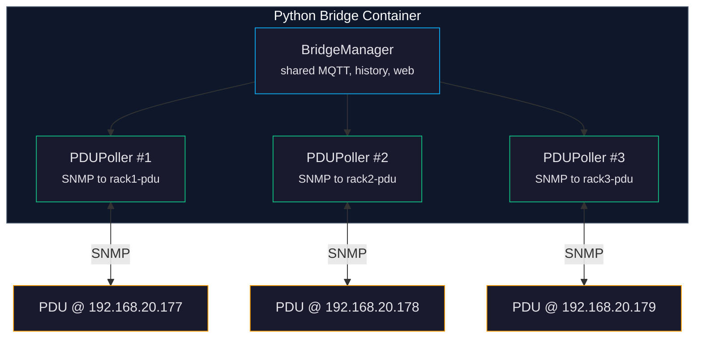

# Multi-PDU Setup

> **Docs:** [Getting Started](getting-started.md) | [Configuration](configuration.md) | [API Reference](api-reference.md) | [Architecture](architecture.md) | [MQTT Topics](mqtt-topics.md) | [SNMP OIDs](snmp-oids.md) | [Multi-PDU](multi-pdu.md) | [Security](security.md) | [Troubleshooting](troubleshooting.md)

The bridge can monitor multiple CyberPower PDUs from a single instance. Each PDU gets its own SNMP poller, automation engine, outlet name overrides, and MQTT topic namespace -- all running concurrently in the same bridge container.

---

## When You Need Multi-PDU

You should use multi-PDU mode if you have:

- Multiple PDUs in the same rack or across racks
- A primary and backup PDU
- PDUs on different subnets that a single bridge can reach
- A centralized monitoring dashboard for your entire power infrastructure

If you only have one PDU, the default single-PDU mode (configured via `.env`) is simpler and works perfectly.

---

## How It Works



The `BridgeManager` is the top-level orchestrator. It creates shared services (MQTT connection, SQLite history database, web server) and then launches one `PDUPoller` per configured PDU as concurrent asyncio tasks. Pollers are staggered by 100ms at startup to avoid SNMP congestion.

Each poller independently:
- Discovers the PDU's identity (model, serial, outlet count) via SNMP
- Auto-detects the bank count
- Runs its own 1Hz poll loop
- Evaluates its own automation rules (stored in `/data/rules_{device_id}.json`)
- Manages its own outlet name overrides (stored in `/data/outlet_names_{device_id}.json`)

All pollers share the same MQTT connection, history database (with a `device_id` column), and web server.

---

## pdus.json Format

Create a `pdus.json` file to configure your PDUs. The file is stored at the path specified by `BRIDGE_PDUS_FILE` (default: `/data/pdus.json` inside the container).

```json
{
  "pdus": [
    {
      "device_id": "rack1-pdu",
      "host": "192.168.20.177",
      "snmp_port": 161,
      "community_read": "public",
      "community_write": "private",
      "label": "Main Rack PDU",
      "enabled": true,
      "num_banks": 2
    },
    {
      "device_id": "rack2-pdu",
      "host": "192.168.20.178",
      "label": "Secondary Rack PDU"
    },
    {
      "device_id": "old-pdu",
      "host": "192.168.20.179",
      "label": "Decommissioned",
      "enabled": false
    }
  ]
}
```

### Field reference

| Field | Required | Default | Description |
|-------|----------|---------|-------------|
| `device_id` | Yes | -- | Unique ID used in MQTT topics (`pdu/{device_id}/...`) and API queries. Must not contain `/ # + ` or spaces. |
| `host` | Yes | -- | IP address or hostname of the PDU |
| `snmp_port` | No | `161` | SNMP port |
| `community_read` | No | `public` | SNMP v2c read community string |
| `community_write` | No | `private` | SNMP v2c write community string |
| `label` | No | `""` | Human-friendly display name for the web UI |
| `enabled` | No | `true` | Set to `false` to skip this PDU without removing it from the file |
| `num_banks` | No | `2` | Default bank count hint (auto-detected from SNMP at startup) |

### Configuration priority

The bridge loads PDU configuration in this order:

1. **pdus.json** -- If the file exists and contains valid PDU entries, it is used exclusively. The `.env` single-PDU variables (`PDU_HOST`, etc.) are ignored.
2. **Environment variables** -- If pdus.json does not exist, the bridge falls back to the single-PDU settings from `.env`.
3. **Mock mode** -- If `BRIDGE_MOCK_MODE=true` and no other config is found, a simulated PDU is created.

---

## Using the Wizard

The interactive wizard walks you through discovering and configuring PDUs:

```bash
./wizard
```

The wizard:
1. Scans your network for CyberPower PDUs via SNMP
2. Lets you select which PDUs to monitor
3. Tests SNMP connectivity to each selected PDU
4. Writes the `pdus.json` configuration file
5. Prints next steps to get running

The wizard runs inside the Docker container (if the stack is running) or natively if `pysnmp-lextudio` is installed.

---

## Using the Scanner

The scanner discovers CyberPower PDUs on your network without the interactive wizard:

```bash
# Auto-detect subnet and scan
./scan

# Scan a specific subnet
./scan --subnet 192.168.20.0/24

# Scan with a non-default community string
./scan --subnet 10.0.0.0/24 --community my-community

# Adjust timeout per host
./scan --timeout 2
```

The scanner queries each IP for the CyberPower ePDU MIB and prints a table of discovered devices with model, serial number, and outlet count.

---

## Docker Compose for Multiple PDUs

No changes to `docker-compose.yml` are needed for multi-PDU mode. All PDUs are handled by the same bridge container. The only requirement is that the bridge container can reach all PDU IP addresses over the network.

Since the bridge uses `network_mode: host`, it has direct access to the host network and can reach PDUs on any subnet the host can reach.

If you need PDUs on different VLANs or subnets, make sure routing is configured on the host machine.

---

## API Endpoints for PDU Management

You can manage PDUs at runtime through the REST API without editing `pdus.json` manually.

### List all PDUs

```bash
curl http://localhost:8080/api/pdus
```

### Add a new PDU

```bash
curl -X POST http://localhost:8080/api/pdus \
  -H 'Content-Type: application/json' \
  -d '{
    "device_id": "rack3-pdu",
    "host": "192.168.20.179",
    "label": "Third Rack"
  }'
```

### Update a PDU

```bash
curl -X PUT http://localhost:8080/api/pdus/rack3-pdu \
  -H 'Content-Type: application/json' \
  -d '{
    "device_id": "rack3-pdu",
    "host": "192.168.20.179",
    "label": "Updated Label",
    "community_read": "new-community"
  }'
```

### Remove a PDU

```bash
curl -X DELETE http://localhost:8080/api/pdus/rack3-pdu
```

### Discover PDUs on the network

```bash
curl -X POST http://localhost:8080/api/pdus/discover
```

Changes made through the API are persisted to `pdus.json` automatically.

> **Note:** Adding or removing PDUs through the API updates the configuration file, but new pollers are not started until the bridge is restarted. To start polling a newly added PDU, restart the bridge: `./start --restart`.

---

## MQTT Topic Namespacing

Each PDU gets its own namespace in the MQTT topic hierarchy:

```
pdu/rack1-pdu/status              # Full status JSON for rack1-pdu
pdu/rack1-pdu/outlet/1/state      # Outlet 1 state on rack1-pdu
pdu/rack1-pdu/bank/1/power        # Bank 1 power on rack1-pdu

pdu/rack2-pdu/status              # Full status JSON for rack2-pdu
pdu/rack2-pdu/outlet/1/state      # Outlet 1 state on rack2-pdu
pdu/rack2-pdu/bank/1/power        # Bank 1 power on rack2-pdu
```

Subscribe to all PDUs at once:

```bash
mosquitto_sub -t 'pdu/#' -v
```

Subscribe to a specific PDU:

```bash
mosquitto_sub -t 'pdu/rack1-pdu/#' -v
```

Commands also use the device namespace:

```bash
# Turn off outlet 3 on rack2-pdu
mosquitto_pub -t 'pdu/rack2-pdu/outlet/3/command' -m 'off'
```

---

## Web UI Device Selector

When multiple PDUs are registered, the web dashboard shows a device selector in the header. Select a PDU to view its status, outlets, charts, and automation rules.

The API endpoints accept `?device_id=` to filter by device:

```bash
# Get status for a specific PDU
curl http://localhost:8080/api/status?device_id=rack2-pdu

# Get bank history for a specific PDU
curl http://localhost:8080/api/history/banks?range=1h&device_id=rack1-pdu

# List automation rules for a specific PDU
curl http://localhost:8080/api/rules?device_id=rack1-pdu
```

---

## Home Assistant with Multiple PDUs

Each PDU appears as a separate device in Home Assistant. MQTT Discovery configurations are published per-device, so you get:

- Separate outlet switches for each PDU
- Separate bank sensors for each PDU
- Separate bridge status sensors for each PDU

Devices are named `CyberPower {DEVICE_ID}` (e.g., `CyberPower RACK1-PDU`).

---

## Per-Device Data Storage

In multi-PDU mode, each PDU gets its own:

| Data | Single-PDU Path | Multi-PDU Path |
|------|----------------|----------------|
| Automation rules | `/data/rules.json` | `/data/rules_{device_id}.json` |
| Outlet names | `/data/outlet_names.json` | `/data/outlet_names_{device_id}.json` |
| History | Shared `history.db` with `device_id=''` | Shared `history.db` with `device_id` column |
| Energy reports | Shared table, one per week | Shared table, one per week per device |
