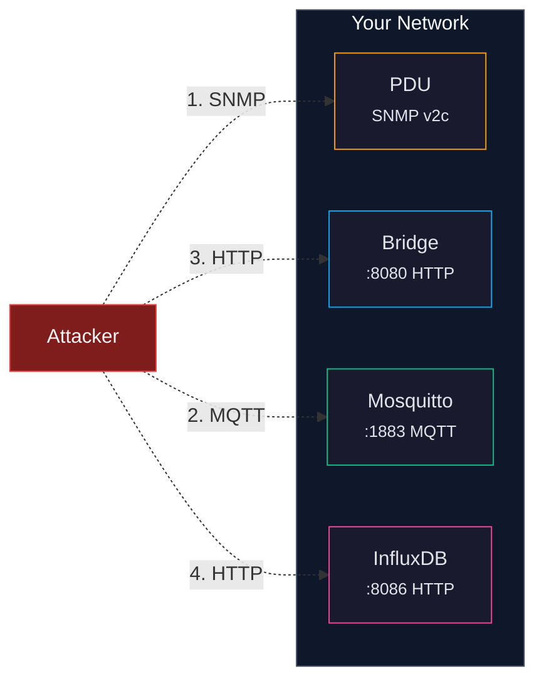

# Security Hardening

> **Docs:** [Getting Started](getting-started.md) | [Configuration](configuration.md) | [API Reference](api-reference.md) | [Architecture](architecture.md) | [MQTT Topics](mqtt-topics.md) | [SNMP OIDs](snmp-oids.md) | [Multi-PDU](multi-pdu.md) | [Security](security.md) | [Troubleshooting](troubleshooting.md)

This guide covers how to harden each component of the CyberPower PDU Bridge stack for production use. The defaults are designed for easy setup -- anonymous MQTT, default SNMP communities, plain-text passwords -- but you should lock these down before deploying in a production environment.

---

## Overview

The stack has four attack surfaces, each with its own hardening steps:



---

## 1. SNMP Hardening

SNMP v2c (the version used by CyberPower PDUs) sends community strings in **plain text** over the network. Anyone who can capture network traffic between the bridge and the PDU can read the community strings and gain full control of the PDU.

### Change default community strings

The defaults (`public` for read, `private` for write) are well-known and should always be changed.

1. **On the PDU:** Log into the PDU's web management interface and change the SNMP community strings under Network Management > SNMP. Consult your PDU's manual for the exact steps.

2. **In your .env file:**

```ini
PDU_COMMUNITY_READ=my-read-community-2026
PDU_COMMUNITY_WRITE=my-write-community-2026
```

3. **In pdus.json (multi-PDU):**

```json
{
  "pdus": [
    {
      "device_id": "rack1-pdu",
      "host": "192.168.20.177",
      "community_read": "my-read-community-2026",
      "community_write": "my-write-community-2026"
    }
  ]
}
```

### Use SNMPv3 if available

Some newer CyberPower PDU models support SNMPv3, which adds authentication and encryption. If your PDU supports it, configuring SNMPv3 eliminates the plain-text community string problem entirely. Check your PDU's firmware version and documentation.

> **Note:** The current bridge uses SNMPv2c exclusively. SNMPv3 support would require changes to the `snmp_client.py` module.

### Network isolation

Since SNMP v2c cannot be encrypted, the best mitigation is to isolate SNMP traffic:

- Place PDUs on a dedicated management VLAN
- Use firewall rules to restrict SNMP access to only the bridge host
- Never expose SNMP ports (161/UDP) to the internet or untrusted networks

---

## 2. MQTT Hardening

By default, Mosquitto allows anonymous connections with no authentication or encryption. Anyone on the network can subscribe to all PDU data or publish commands to control outlets.

### Enable MQTT authentication

1. **Create a password file** on the host:

```bash
# Create the password file (interactive prompt)
docker compose exec mosquitto mosquitto_passwd -c /mosquitto/config/passwd pdu-bridge

# Add additional users
docker compose exec mosquitto mosquitto_passwd /mosquitto/config/passwd dashboard-user
```

2. **Update mosquitto.conf** (`mosquitto/mosquitto.conf`):

```
listener 1883
protocol mqtt

listener 9001
protocol websockets

# Disable anonymous access
allow_anonymous false

# Password file
password_file /mosquitto/config/passwd

persistence true
persistence_location /mosquitto/data/

log_dest stdout
log_type all
```

3. **Add the password file volume** to `docker-compose.yml` (under the mosquitto service volumes):

```yaml
volumes:
  - ./mosquitto/mosquitto.conf:/mosquitto/config/mosquitto.conf
  - ./mosquitto/passwd:/mosquitto/config/passwd
  - mosquitto-data:/mosquitto/data
  - mosquitto-log:/mosquitto/log
```

4. **Configure the bridge** to authenticate in `.env`:

```ini
MQTT_USERNAME=pdu-bridge
MQTT_PASSWORD=your-secure-password
```

5. **Restart the stack:**

```bash
docker compose down && docker compose up -d
```

### Enable MQTT TLS

For encrypted MQTT connections, configure Mosquitto with TLS certificates:

1. **Generate or obtain certificates** (self-signed example):

```bash
mkdir -p mosquitto/certs

# Generate CA key and certificate
openssl req -new -x509 -days 365 -extensions v3_ca \
  -keyout mosquitto/certs/ca.key \
  -out mosquitto/certs/ca.crt \
  -subj "/CN=PDU MQTT CA"

# Generate server key and certificate
openssl genrsa -out mosquitto/certs/server.key 2048
openssl req -new -key mosquitto/certs/server.key \
  -out mosquitto/certs/server.csr \
  -subj "/CN=mosquitto"
openssl x509 -req -in mosquitto/certs/server.csr \
  -CA mosquitto/certs/ca.crt -CAkey mosquitto/certs/ca.key \
  -CAcreateserial -out mosquitto/certs/server.crt -days 365
```

2. **Update mosquitto.conf**:

```
# Encrypted listener
listener 8883
protocol mqtt
cafile /mosquitto/certs/ca.crt
certfile /mosquitto/certs/server.crt
keyfile /mosquitto/certs/server.key

# Unencrypted listener (for local bridge only, optional)
listener 1883 127.0.0.1
protocol mqtt

allow_anonymous false
password_file /mosquitto/config/passwd
```

3. **Mount the certs directory** in `docker-compose.yml`.

### Access control lists (ACLs)

For fine-grained control, create an ACL file that restricts which users can read/write which topics:

```
# mosquitto/acl

# Bridge can publish and subscribe to everything
user pdu-bridge
topic readwrite pdu/#
topic readwrite homeassistant/#

# Dashboard user can only read
user dashboard-user
topic read pdu/#
```

Add to mosquitto.conf:

```
acl_file /mosquitto/config/acl
```

---

## 3. Web Dashboard / REST API

The bridge's web server (port 8080) has no built-in authentication. Anyone who can reach it can view PDU data, control outlets, and manage automation rules.

### Reverse proxy with authentication

Place the bridge behind a reverse proxy (nginx, Caddy, Traefik) that handles authentication and TLS.

**nginx example** (`/etc/nginx/sites-available/pdu`):

```nginx
server {
    listen 443 ssl;
    server_name pdu.example.com;

    ssl_certificate /etc/letsencrypt/live/pdu.example.com/fullchain.pem;
    ssl_certificate_key /etc/letsencrypt/live/pdu.example.com/privkey.pem;

    # Basic authentication
    auth_basic "PDU Dashboard";
    auth_basic_user_file /etc/nginx/.htpasswd;

    location / {
        proxy_pass http://127.0.0.1:8080;
        proxy_set_header Host $host;
        proxy_set_header X-Real-IP $remote_addr;
        proxy_set_header X-Forwarded-For $proxy_add_x_forwarded_for;
        proxy_set_header X-Forwarded-Proto $scheme;
    }
}
```

Create the password file:

```bash
sudo apt install apache2-utils
sudo htpasswd -c /etc/nginx/.htpasswd admin
```

### Restrict to localhost

If you only access the dashboard from the bridge host itself, bind to localhost only by changing the bridge's web server or using firewall rules:

```bash
# Allow only localhost to reach port 8080
sudo iptables -A INPUT -p tcp --dport 8080 -s 127.0.0.1 -j ACCEPT
sudo iptables -A INPUT -p tcp --dport 8080 -j DROP
```

---

## 4. InfluxDB Hardening

The default InfluxDB configuration uses weak credentials that should be changed immediately.

### Change default credentials

In your `.env` file, update these **before first run** (InfluxDB credentials are set during initial setup and cannot be easily changed afterward):

```ini
INFLUXDB_ADMIN_USER=your-admin-user
INFLUXDB_ADMIN_PASSWORD=a-strong-password-here
INFLUXDB_ADMIN_TOKEN=a-random-api-token-here
```

Generate a random token:

```bash
openssl rand -hex 32
```

### Restrict network access

InfluxDB's web UI and API are exposed on port 8086. If you do not need external access:

1. **Remove the port mapping** from `docker-compose.yml`:

```yaml
influxdb:
  image: influxdb:2.7
  # ports:            # Comment out or remove
  #   - "8086:8086"   # to disable external access
```

Telegraf can still reach InfluxDB via the Docker network.

2. **Or bind to localhost only:**

```yaml
ports:
  - "127.0.0.1:8086:8086"
```

---

## 5. Network-Level Security

### Firewall rules

On the bridge host, restrict incoming connections to only what is needed:

```bash
# Allow SSH
sudo ufw allow 22/tcp

# Allow web dashboard (from trusted network only)
sudo ufw allow from 192.168.0.0/16 to any port 8080

# Allow MQTT (from trusted network only)
sudo ufw allow from 192.168.0.0/16 to any port 1883

# Deny InfluxDB from external access
sudo ufw deny 8086

# Enable firewall
sudo ufw enable
```

### Disable unused services

If you do not use InfluxDB and Telegraf, you can remove them from your stack entirely by commenting them out in `docker-compose.yml`. The bridge works perfectly without them -- historical data is stored in SQLite.

### Keep software updated

```bash
# Update container images
docker compose pull
docker compose up -d --build

# Update the bridge code
git pull
docker compose up -d --build
```

---

## Security Checklist

| Item | Default | Recommended |
|------|---------|-------------|
| SNMP community strings | `public` / `private` | Change to unique strings |
| MQTT authentication | Anonymous | Enable username/password |
| MQTT encryption | None (plain text) | Enable TLS |
| Web dashboard auth | None | Reverse proxy with auth |
| InfluxDB credentials | `admin` / `changeme123` | Change before first run |
| InfluxDB network | Exposed on :8086 | Bind to localhost or disable port mapping |
| Firewall | None | Restrict to trusted networks |
| PDU network | Shared | Dedicated management VLAN |
