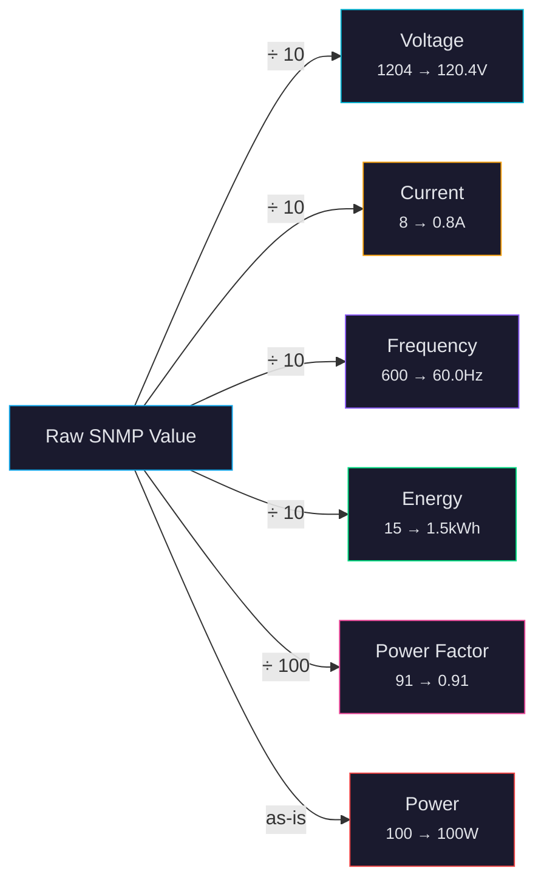

# SNMP OID Reference

CyberPower ePDU MIB — base OID: `1.3.6.1.4.1.3808.1.1.3`

## OID Tree Structure

```mermaid
graph TD
    Root["1.3.6.1.4.1.3808.1.1.3<br/><small>CyberPower ePDU MIB</small>"]

    Root --> Identity[".1 — Identity"]
    Root --> Banks[".2 — Banks"]
    Root --> Outlets[".3 — Outlets"]
    Root --> Input[".5 — Input"]

    Identity --> DevName[".1.1.0<br/><small>Device Name</small>"]
    Identity --> OutCount[".1.3.0<br/><small>Outlet Count</small>"]
    Identity --> PhaseCount[".1.4.0<br/><small>Phase Count</small>"]

    Banks --> BankTable[".2.3.1.1 — Bank Table"]
    BankTable --> BCurrent[".2.{idx}<br/><small>Current (÷10)</small>"]
    BankTable --> BLoad[".3.{idx}<br/><small>Load State</small>"]
    BankTable --> BVoltage[".6.{idx}<br/><small>Voltage (÷10)</small>"]
    BankTable --> BPower[".7.{idx}<br/><small>Active Power</small>"]
    BankTable --> BApparent[".8.{idx}<br/><small>Apparent Power</small>"]
    BankTable --> BPF[".9.{idx}<br/><small>Power Factor (÷100)</small>"]

    Outlets --> OutConfig[".3.3.1.1 — Config"]
    Outlets --> OutStatus[".3.5.1.1 — Status"]
    OutConfig --> OName[".2.{n}<br/><small>Outlet Name</small>"]
    OutConfig --> OCmd[".4.{n}<br/><small>Command</small>"]
    OutStatus --> OState[".4.{n}<br/><small>State</small>"]
    OutStatus --> OCurrent[".5.{n}<br/><small>Current (÷10)</small>"]
    OutStatus --> OPower[".6.{n}<br/><small>Power</small>"]
    OutStatus --> OEnergy[".7.{n}<br/><small>Energy (÷10)</small>"]

    Input --> Voltage[".5.7.0<br/><small>Input Voltage</small>"]
    Input --> Freq[".5.8.0<br/><small>Input Frequency</small>"]

    style Root fill:#1a1a2e,stroke:#0ea5e9,color:#e2e4e9
    style Identity fill:#1a1a2e,stroke:#8b5cf6,color:#e2e4e9
    style Banks fill:#1a1a2e,stroke:#f59e0b,color:#e2e4e9
    style Outlets fill:#1a1a2e,stroke:#00dc82,color:#e2e4e9
    style Input fill:#1a1a2e,stroke:#06b6d4,color:#e2e4e9
    style BankTable fill:#1a1a2e,stroke:#f59e0b,color:#e2e4e9
    style OutConfig fill:#1a1a2e,stroke:#00dc82,color:#e2e4e9
    style OutStatus fill:#1a1a2e,stroke:#00dc82,color:#e2e4e9
```



## Device Identity

| OID Suffix | Full OID | Description |
|-----------|----------|-------------|
| `.1.1.0` | `...3.1.1.0` | ePDUIdentName — device name |
| `.1.3.0` | `...3.1.3.0` | ePDUIdentDeviceNumOutlets |
| `.1.4.0` | `...3.1.4.0` | ePDUIdentDeviceNumPhases |

## Input

| OID Suffix | Full OID | Description | Unit |
|-----------|----------|-------------|------|
| `.5.7.0` | `...3.5.7.0` | Input voltage | Tenths of volts |
| `.5.8.0` | `...3.5.8.0` | Input frequency | Tenths of Hz |

## Outlet Table

Index `{n}` = outlet number (1-based).

| OID Suffix | Description | Type |
|-----------|-------------|------|
| `.3.3.1.1.2.{n}` | Outlet name | String |
| `.3.3.1.1.4.{n}` | Outlet command | Integer: 1=on, 2=off, 3=reboot |
| `.3.5.1.1.4.{n}` | Outlet state | Integer: 1=on, 2=off |
| `.3.5.1.1.5.{n}` | Outlet current | Tenths of amps |
| `.3.5.1.1.6.{n}` | Outlet power | Watts |
| `.3.5.1.1.7.{n}` | Outlet energy | Tenths of kWh |

## Bank Table

Index `{idx}` = bank number (1-based). PDU44001 has 2 banks.

| OID Suffix | Description | Type |
|-----------|-------------|------|
| `.2.3.1.1.2.{idx}` | Bank current | Tenths of amps |
| `.2.3.1.1.3.{idx}` | Bank load state | 1=normal, 2=low, 3=nearOverload, 4=overload |
| `.2.3.1.1.6.{idx}` | Bank voltage | Tenths of volts |
| `.2.3.1.1.7.{idx}` | Bank active power | Watts |
| `.2.3.1.1.8.{idx}` | Bank apparent power | VA |
| `.2.3.1.1.9.{idx}` | Bank power factor | Hundredths (e.g. 95 = 0.95) |

## Value Scaling



## Metering Floor

The PDU44001 has a minimum measurement threshold for idle outlets:
- **Current**: raw value ≤ 2 (0.2A) → zeroed to 0.0A
- **Power**: raw value ≤ 1 (1W) → zeroed to 0.0W

The bridge applies these corrections automatically.

## Discovery

Run a full walk to see all available OIDs:

```bash
snmpwalk -v2c -c public 192.168.20.177 1.3.6.1.4.1.3808.1.1.3
```

Or use the test script:

```bash
./test --snmpwalk
```
