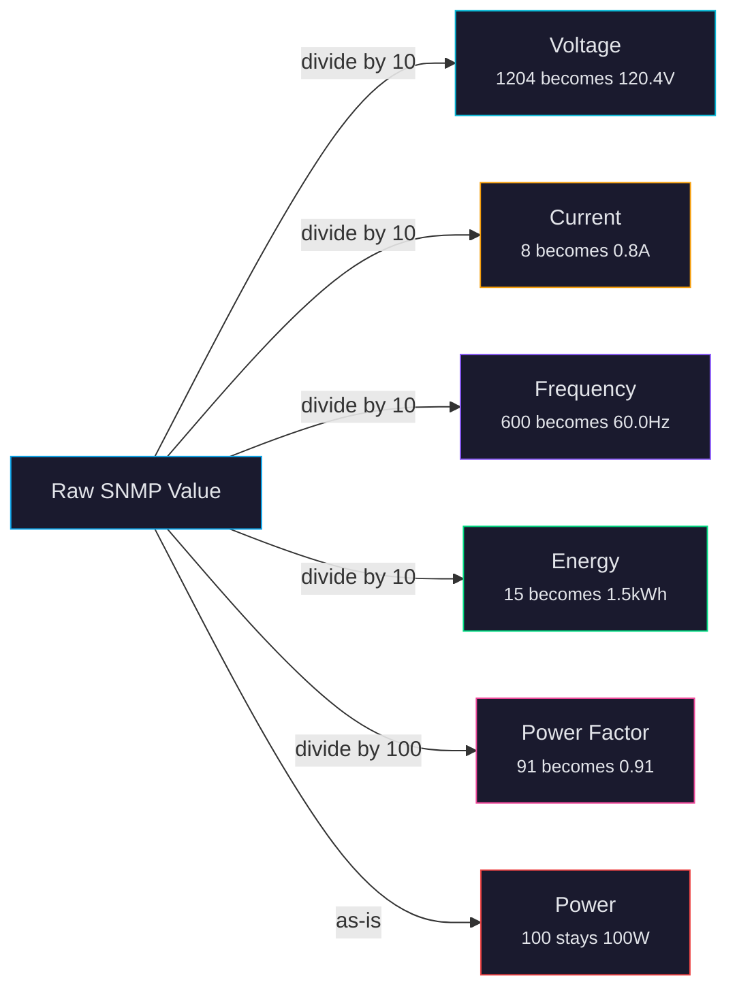

# SNMP OID Reference

> **Docs navigation:** [Architecture](architecture.md) | [MQTT Topics](mqtt-topics.md) | [SNMP OIDs](snmp-oids.md) (you are here) | [README](../README.md)

This page documents every SNMP OID (data address) used to communicate with the CyberPower PDU44001. If you are new to SNMP, start with the background section below. If you just need the OID tables, skip to [OID Tree Structure](#oid-tree-structure).

---

## What is SNMP?

**SNMP** (Simple Network Management Protocol) is a decades-old standard for monitoring and managing network-connected devices. It was first defined in 1988 and remains the most widely supported management protocol for enterprise hardware -- PDUs, switches, routers, UPS units, and more.

### How SNMP works

At its core, SNMP is a simple request/response protocol. A **manager** (our Python bridge) asks a **device** (the PDU) for specific pieces of data, and the device responds with values.

There are two main operations this project uses:

- **GET** -- "Read this value." For example: "What is the voltage on bank 1?"
- **SET** -- "Write this value." For example: "Turn outlet 3 off."

### What is an OID?

Every piece of data a device can report is identified by an **OID** (Object Identifier) -- a string of numbers separated by dots, like a very specific address. For example:

```
1.3.6.1.4.1.3808.1.1.3.2.3.1.1.6.1
```

This looks intimidating, but it has a structure. Reading from left to right:

| Segment | Meaning |
|---------|---------|
| `1.3.6.1.4.1` | Standard prefix meaning "private enterprise" |
| `3808` | CyberPower's registered enterprise number |
| `1.1.3` | CyberPower ePDU product line |
| `2.3.1.1.6` | Bank table, voltage column |
| `1` | Bank number 1 |

So this OID means: "CyberPower ePDU, bank table, voltage for bank 1."

### What is a MIB?

A **MIB** (Management Information Base) is a document that maps human-readable names to OID numbers. It is like a dictionary for SNMP. The CyberPower ePDU MIB defines names like `ePDUBankStatusVoltage` for OID `.2.3.1.1.6.{idx}`. The bridge uses raw OIDs directly (no MIB file needed at runtime), but the MIB is useful for understanding what each OID means.

### What is a community string?

SNMP v2c (the version the PDU44001 uses) authenticates requests using **community strings** -- essentially passwords sent in plain text. This project uses:

- `public` (default) for read-only access (GET requests)
- `private` (default) for read-write access (SET requests, such as turning outlets on/off)

These are configured via `PDU_COMMUNITY_READ` and `PDU_COMMUNITY_WRITE` in your `.env` file.

### Why SNMP for this project?

The CyberPower PDU44001 **only speaks SNMP**. There is no REST API, no MQTT support, no web API, and no other way to programmatically read its data or control its outlets. SNMP is the sole interface.

The Python bridge exists to translate this SNMP data into MQTT (a modern, IoT-friendly protocol) so that tools like Home Assistant, Node-RED, and Telegraf can consume it. You do not need to understand SNMP to use this system -- the bridge handles all of it. This reference is here for developers who want to understand the raw data source, add new OIDs, or troubleshoot communication issues.

---

## CyberPower ePDU MIB

All OIDs in this project live under a common base:

```
1.3.6.1.4.1.3808.1.1.3
```

In the tables below, OID suffixes are relative to this base. For example, `.1.1.0` means the full OID is `1.3.6.1.4.1.3808.1.1.3.1.1.0`.

---

## OID Tree Structure

The diagram below shows how OIDs are organized into logical groups. Each branch of the tree corresponds to a section of the PDU's data model.

```mermaid
graph TD
    Root["1.3.6.1.4.1.3808.1.1.3<br/><small>CyberPower ePDU MIB</small>"]

    Root --> Identity[".1 — Identity"]
    Root --> Banks[".2 — Banks"]
    Root --> Outlets[".3 — Outlets"]
    Root --> Input[".5 — Input"]

    Identity --> DevName[".1.1.0<br/><small>Device Name</small>"]
    Identity --> OutCount[".1.3.0<br/><small>Outlet Count</small>"]
    Identity --> PhaseCount[".1.4.0<br/><small>Phase Count</small>"]

    Banks --> BankTable[".2.3.1.1 — Bank Table"]
    BankTable --> BCurrent[".2.{idx}<br/><small>Current (divide by 10)</small>"]
    BankTable --> BLoad[".3.{idx}<br/><small>Load State</small>"]
    BankTable --> BVoltage[".6.{idx}<br/><small>Voltage (divide by 10)</small>"]
    BankTable --> BPower[".7.{idx}<br/><small>Active Power</small>"]
    BankTable --> BApparent[".8.{idx}<br/><small>Apparent Power</small>"]
    BankTable --> BPF[".9.{idx}<br/><small>Power Factor (divide by 100)</small>"]

    Outlets --> OutConfig[".3.3.1.1 — Config"]
    Outlets --> OutStatus[".3.5.1.1 — Status"]
    OutConfig --> OName[".2.{n}<br/><small>Outlet Name</small>"]
    OutConfig --> OCmd[".4.{n}<br/><small>Command</small>"]
    OutStatus --> OState[".4.{n}<br/><small>State</small>"]
    OutStatus --> OCurrent[".5.{n}<br/><small>Current (divide by 10)</small>"]
    OutStatus --> OPower[".6.{n}<br/><small>Power</small>"]
    OutStatus --> OEnergy[".7.{n}<br/><small>Energy (divide by 10)</small>"]

    Input --> Voltage[".5.7.0<br/><small>Input Voltage</small>"]
    Input --> Freq[".5.8.0<br/><small>Input Frequency</small>"]

    style Root fill:#1a1a2e,stroke:#0ea5e9,color:#e2e4e9
    style Identity fill:#1a1a2e,stroke:#8b5cf6,color:#e2e4e9
    style Banks fill:#1a1a2e,stroke:#f59e0b,color:#e2e4e9
    style Outlets fill:#1a1a2e,stroke:#00dc82,color:#e2e4e9
    style Input fill:#1a1a2e,stroke:#06b6d4,color:#e2e4e9
    style BankTable fill:#1a1a2e,stroke:#f59e0b,color:#e2e4e9
    style OutConfig fill:#1a1a2e,stroke:#00dc82,color:#e2e4e9
    style OutStatus fill:#1a1a2e,stroke:#00dc82,color:#e2e4e9
```



**How to read this diagram:**

- The **root node** is the CyberPower ePDU MIB base OID. Every other OID is a child of this.
- **Purple** (Identity): Static device information (name, outlet count).
- **Yellow/orange** (Banks): Per-bank electrical measurements (the PDU44001 has 2 banks).
- **Green** (Outlets): Per-outlet state, control, and measurements (10 outlets).
- **Blue** (Input): Incoming power supply characteristics.
- `{idx}` and `{n}` are replaced with the bank or outlet number (1-based).

---

## Device Identity

These OIDs return static information about the PDU. They do not change during operation.

| OID Suffix | Full OID | Description |
|-----------|----------|-------------|
| `.1.1.0` | `...3.1.1.0` | **ePDUIdentName** -- The configured device name |
| `.1.3.0` | `...3.1.3.0` | **ePDUIdentDeviceNumOutlets** -- Total number of outlets (10 for the PDU44001) |
| `.1.4.0` | `...3.1.4.0` | **ePDUIdentDeviceNumPhases** -- Number of electrical phases |

---

## Input

These OIDs report the characteristics of the incoming power supply. They apply to the entire PDU, not individual outlets or banks.

| OID Suffix | Full OID | Description | Unit |
|-----------|----------|-------------|------|
| `.5.7.0` | `...3.5.7.0` | Input voltage | Tenths of volts (e.g., `1204` = 120.4V) |
| `.5.8.0` | `...3.5.8.0` | Input frequency | Tenths of Hz (e.g., `600` = 60.0 Hz) |

---

## Outlet Table

Each outlet has a set of OIDs for configuration (names, commands) and status (state, measurements). The index `{n}` is the outlet number, starting at 1.

### Outlet Configuration (read/write)

| OID Suffix | Description | Type |
|-----------|-------------|------|
| `.3.3.1.1.2.{n}` | **Outlet name** -- Human-readable label | String |
| `.3.3.1.1.4.{n}` | **Outlet command** -- Send a control command | Integer: `1` = on, `2` = off, `3` = reboot |

### Outlet Status (read-only)

| OID Suffix | Description | Type |
|-----------|-------------|------|
| `.3.5.1.1.4.{n}` | **Outlet state** -- Current relay position | Integer: `1` = on, `2` = off |
| `.3.5.1.1.5.{n}` | **Outlet current** -- Current draw | Tenths of amps (e.g., `8` = 0.8A) |
| `.3.5.1.1.6.{n}` | **Outlet power** -- Active power consumption | Watts (no scaling needed) |
| `.3.5.1.1.7.{n}` | **Outlet energy** -- Cumulative energy usage | Tenths of kWh (e.g., `15` = 1.5 kWh) |

**Note:** Per-outlet current, power, and energy OIDs may not return data on the PDU44001 "Switched" model. These are only populated on "Metered-by-Outlet" models. The bridge gracefully handles missing values.

---

## Bank Table

A **bank** is a group of outlets that share a common electrical circuit. The PDU44001 has 2 banks. The index `{idx}` is the bank number (1 or 2).

| OID Suffix | Description | Type |
|-----------|-------------|------|
| `.2.3.1.1.2.{idx}` | **Bank current** -- Total current draw for the bank | Tenths of amps |
| `.2.3.1.1.3.{idx}` | **Bank load state** -- Whether the bank is within safe limits | Integer: `1` = normal, `2` = low, `3` = nearOverload, `4` = overload |
| `.2.3.1.1.6.{idx}` | **Bank voltage** -- Voltage on this bank's circuit | Tenths of volts |
| `.2.3.1.1.7.{idx}` | **Bank active power** -- Real power being consumed | Watts (no scaling needed) |
| `.2.3.1.1.8.{idx}` | **Bank apparent power** -- Total power including reactive component | VA (volt-amps, no scaling needed) |
| `.2.3.1.1.9.{idx}` | **Bank power factor** -- Ratio of real to apparent power | Hundredths (e.g., `95` = 0.95) |

### Understanding power metrics

If you are not familiar with electrical measurements, here is a brief explanation of the bank metrics:

- **Voltage** -- The electrical pressure in the circuit, measured in volts. In North America, standard household circuits are approximately 120V.
- **Current** -- The flow of electricity, measured in amps. Higher current means more power is being drawn.
- **Active power (watts)** -- The actual power doing useful work (running your servers, charging batteries).
- **Apparent power (VA)** -- The total power the circuit is handling, including reactive power from motors, transformers, and power supplies that does not do useful work.
- **Power factor** -- How efficiently the load is using power. A value of `1.0` means 100% efficient (all power is doing useful work). A value of `0.7` means 30% of the apparent power is wasted as reactive power. Most computer equipment has a power factor between 0.9 and 1.0.
- **Load state** -- A simplified safety indicator. `normal` means the bank is well within its rated capacity. `nearOverload` and `overload` mean you should reduce load to prevent tripping a breaker or damaging equipment.

---

## Value Scaling

The PDU reports many values as integers that need to be divided to get the real value. This avoids the complexity of floating-point numbers over SNMP. The bridge handles all of this conversion automatically -- the values you see in MQTT topics and the web dashboard are already scaled.

The diagram below shows the conversion rules:



**Summary table:**

| Metric | Raw Unit | Divide By | Result Unit | Example |
|--------|----------|-----------|-------------|---------|
| Voltage | Tenths of volts | 10 | Volts | `1204` becomes `120.4V` |
| Current | Tenths of amps | 10 | Amps | `8` becomes `0.8A` |
| Frequency | Tenths of Hz | 10 | Hz | `600` becomes `60.0 Hz` |
| Energy | Tenths of kWh | 10 | kWh | `15` becomes `1.5 kWh` |
| Power Factor | Hundredths | 100 | Ratio (0-1) | `91` becomes `0.91` |
| Power (watts) | Watts | 1 (no scaling) | Watts | `100` stays `100W` |
| Apparent Power (VA) | VA | 1 (no scaling) | VA | `150` stays `150 VA` |

---

## Metering Floor

The PDU44001 has a minimum measurement threshold. When an outlet is idle or has a very light load, the PDU still reports small non-zero values due to measurement noise in its sensors. The bridge automatically corrects for this:

| Metric | Threshold | Correction |
|--------|-----------|------------|
| Current | Raw value of 2 or less (0.2A) | Zeroed to 0.0A |
| Power | Raw value of 1 or less (1W) | Zeroed to 0.0W |

This means you will see clean zeros for idle outlets instead of phantom readings, both in MQTT topics and the web dashboard.

---

## Discovery: Exploring OIDs Yourself

If you want to see every OID the PDU exposes (including any not listed above), you can perform an SNMP "walk" -- a process that iterates through all available OIDs on the device.

### Using snmpwalk (command-line)

```bash
# Walk the entire CyberPower ePDU MIB
snmpwalk -v2c -c public 192.168.20.177 1.3.6.1.4.1.3808.1.1.3
```

This will print every OID and its current value. The output can be long -- the PDU44001 has hundreds of OIDs. To narrow it down:

```bash
# Walk only bank data
snmpwalk -v2c -c public 192.168.20.177 1.3.6.1.4.1.3808.1.1.3.2

# Walk only outlet data
snmpwalk -v2c -c public 192.168.20.177 1.3.6.1.4.1.3808.1.1.3.3

# Walk only input data
snmpwalk -v2c -c public 192.168.20.177 1.3.6.1.4.1.3808.1.1.3.5
```

### Using the test script

The project includes a built-in test script that handles the details for you:

```bash
./test --snmpwalk
```

This runs a walk using the configured PDU address and community string from your `.env` file.

---

> **See also:** [Architecture](architecture.md) for the full system design | [MQTT Topics](mqtt-topics.md) for how this SNMP data is published to MQTT
